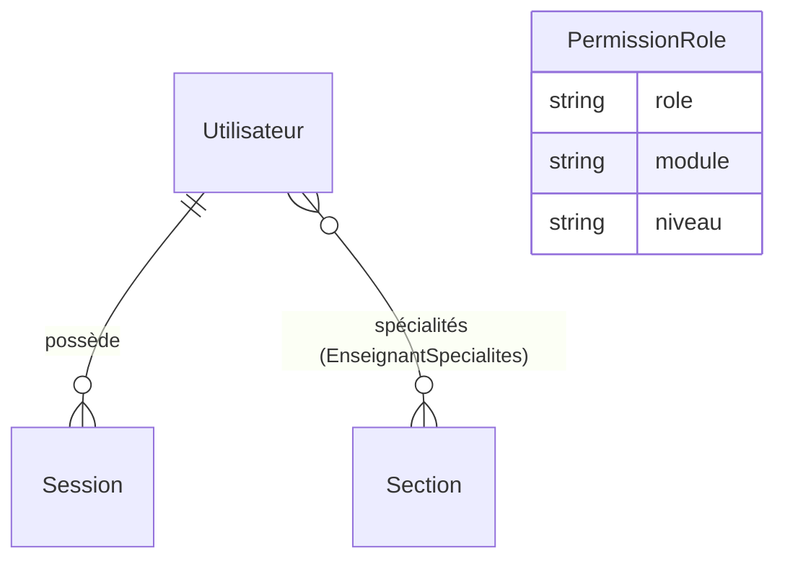
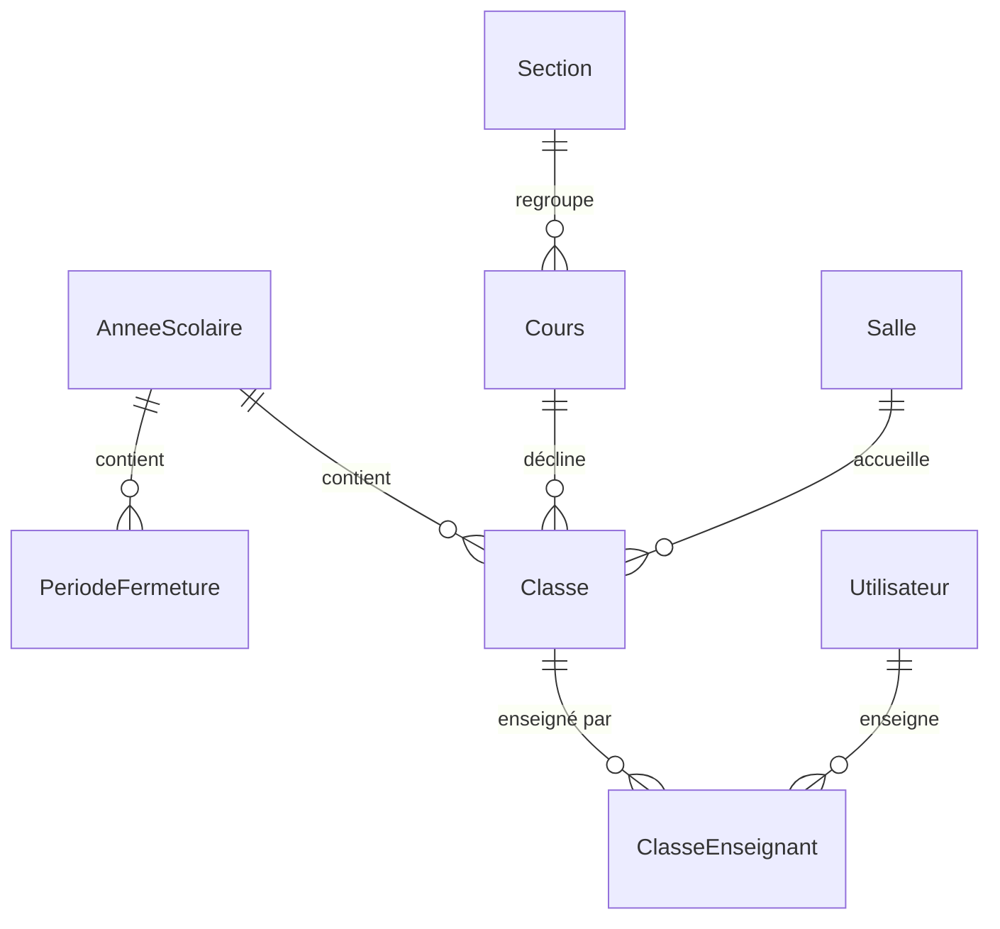
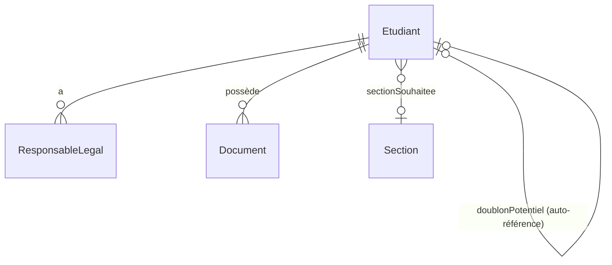
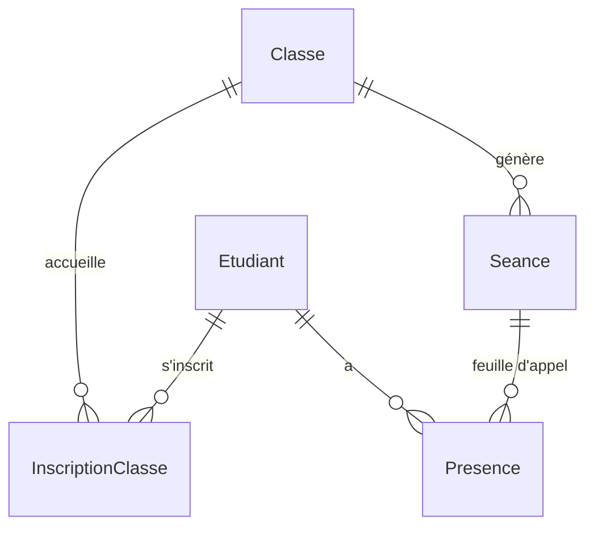
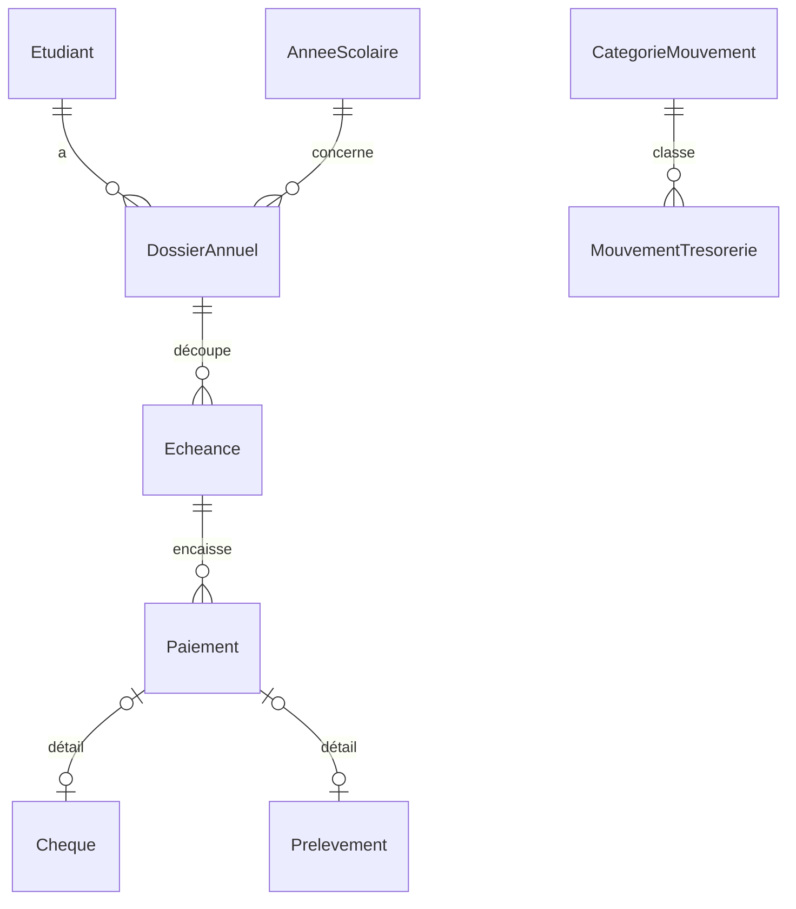

# Documentation technique — L'Orée du Savoir

Application de gestion administrative pour l'association L'Orée du Savoir (étudiants, classes, présences, paiements, trésorerie, comptes), pensée pour remplacer les fichiers Excel existants sans les reproduire techniquement. Ce document décrit l'état réel du code à date de rédaction, à l'usage d'un développeur qui rejoint le projet.

## Table des matières

1. [Structure de la base de données](#1-structure-de-la-base-de-données)
2. [Modules et fonctionnalités](#2-modules-et-fonctionnalités)
3. [Architecture générale](#3-architecture-générale)
4. [Dépendances et technologies](#4-dépendances-et-technologies)
5. [Système de rôles et contrôle d'accès](#5-système-de-rôles-et-contrôle-daccès)
6. [Points d'attention et limitations connues](#6-points-dattention-et-limitations-connues)

---

## 1. Structure de la base de données

PostgreSQL, schéma décrit dans `prisma/schema.prisma` (~700 lignes, commenté phase par phase). Le client Prisma est généré avec le provider `prisma-client` (pas le générateur historique `prisma-client-js`) vers `src/generated/prisma/` — dossier **gitignoré**, régénéré par `npx prisma generate` (ou automatiquement par `prisma migrate dev`). Il s'importe via `@/generated/prisma/client` et `@/generated/prisma/enums`, **jamais** depuis `@prisma/client` directement (ce paquet npm est présent en dépendance mais sert uniquement d'outillage CLI/typing, pas de point d'import applicatif). La connexion passe par l'adapter `@prisma/adapter-pg` (voir `src/lib/prisma.ts`), pas le moteur binaire par défaut — nécessaire pour tourner correctement dans le conteneur Docker de déploiement.

Toutes les tables utilisent un id `String @id @default(cuid())`, et la plupart portent un champ `creeLe DateTime @default(now())`. Les enums Prisma sont préfixés par leur domaine et listés avec les modèles qui les utilisent.

### 1.1 Vue d'ensemble par domaine

| Domaine | Modèles |
|---|---|
| Auth & permissions | `Utilisateur`, `Session`, `PermissionRole` |
| Scolarité (référentiel) | `AnneeScolaire`, `PeriodeFermeture`, `Section`, `Cours`, `Classe`, `ClasseEnseignant` |
| Étudiants | `Etudiant`, `ResponsableLegal`, `Document` |
| Présences | `InscriptionClasse`, `Seance`, `Presence` |
| Paiements | `DossierAnnuel`, `Echeance`, `Paiement`, `Cheque`, `Prelevement` |
| Trésorerie | `CategorieMouvement`, `MouvementTresorerie` |
| Activités | `Activite`, `ActiviteResponsable` |
| Audit | `JournalAudit` |

### 1.2 Auth & permissions



| Modèle | Colonnes principales | Clés / contraintes | Rôle |
|---|---|---|---|
| `Utilisateur` (`utilisateurs`) | `email` (unique), `motDePasseHash`, `nom`, `prenom`, `role` (enum `Role`), `actif`, `dernierLogin` | PK `id` ; `email` unique ; relation N-N `specialites: Section[]` (relation nommée `EnseignantSpecialites`) | Compte staff. `role` fixe la ligne de permissions consultée (sauf Bureau, court-circuité). `specialites` filtre les enseignants proposés à la création d'une classe. |
| `Session` (`sessions`) | `tokenHash` (unique, empreinte SHA-256 du cookie), `utilisateurId` (FK), `expireLe`, `seanceRestreinteId` (FK optionnelle vers `Seance`) | PK `id` ; FK `utilisateurId → Utilisateur` (`onDelete: Cascade`) ; FK `seanceRestreinteId → Seance` (`onDelete: SetNull`) ; index `utilisateurId` | Session opaque stockée en base (pas de JWT) : révocable immédiatement. `seanceRestreinteId` non-null = session née d'un scan QR, cantonnée à la feuille d'appel de cette séance. |
| `PermissionRole` (`permissions_role`) | `role` (enum), `module` (enum `Module`), `niveau` (enum `NiveauAcces`, défaut `AUCUN`) | PK `id` ; unique composite `[role, module]` | Grille rôle × module éditable depuis *Administration → Permissions*. Le rôle `BUREAU` n'y est jamais lu en pratique (voir §5). |

**Enums** : `Role` (`BUREAU`, `ADMINISTRATION`, `ACCUEIL`, `TRESORIER`, `ENSEIGNANT`, `ACTIVITE`) · `Module` (`ETUDIANTS`, `CLASSES`, `PRESENCES`, `ACTIVITES`, `PAIEMENTS`, `TRESORERIE`, `ADMINISTRATION`, `DOCUMENTS`, `INSCRIPTIONS`, `CALENDRIER`) · `NiveauAcces` (`AUCUN`, `LECTURE`, `ECRITURE`).

### 1.3 Scolarité (référentiel)



| Modèle | Colonnes principales | Clés / contraintes | Rôle |
|---|---|---|---|
| `AnneeScolaire` (`annees_scolaires`) | `libelle` (unique, ex. "2026/2027"), `dateDebut`, `dateFin`, `active` | PK `id` | Ancre temporelle de tout le scolaire. Une seule année est censée être `active` à la fois (non contraint en base, géré côté action). |
| `PeriodeFermeture` (`periodes_fermeture`) | `anneeScolaireId` (FK), `libelle`, `dateDebut`, `dateFin` | PK `id` ; FK Cascade ; index `anneeScolaireId` | Vacances/fermetures : aucune `Seance` n'est générée sur ces dates. Modifier/supprimer une période après coup ne régénère pas rétroactivement les séances sautées. |
| `Section` (`sections`) | `nom` (unique), `fraisFormation`/`fraisDossier` (`Decimal(10,2)`), `volumeHoraireAnnuel`, `remboursementAvant15Jours`/`remboursementAvant29Jours` (%) | PK `id` | Référentiel de tarification et de barème de remboursement (4 sections : Jeunes, Langue Arabe, Études Coraniques, Études Islamiques), éditable depuis *Administration → Sections*. Porte aussi la relation inverse `souhaitsPreinscription: Etudiant[]` et `enseignantsSpecialistes: Utilisateur[]`. |
| `Cours` (`cours`) | `sectionId` (FK), `nom` (unique), `description` | PK `id` ; FK `Restrict` ; index `sectionId` | La matière (ex. "Arabe débutant"). Distinct de `Classe` : un cours peut avoir plusieurs classes/créneaux. |
| `Salle` (`salles`) | `nom` (unique), `qrToken` (unique, cuid) | PK `id` | Salle physique, référentiel éditable depuis *Administration → Salles*. Porte le QR permanent affiché en salle : `qrToken` est l'identifiant public (jamais une authentification), fixe tant que la salle existe, quels que soient les cours qui s'y succèdent. |
| `Classe` (`classes`) | `coursId` (FK), `anneeScolaireId` (FK), `niveau`, `semestre`, `jour` (enum `JourSemaine`), `heureDebut`/`heureFin` (`"HH:MM"`), `salleId` (FK optionnelle) | PK `id` ; FK `Restrict` sur `cours`/`anneeScolaire` ; FK `SetNull` sur `salle` ; index `anneeScolaireId`, `coursId`, `salleId` | Groupe concret planifié : un seul créneau hebdomadaire par classe, plusieurs enseignants possibles (via `ClasseEnseignant`). Le QR affiché en salle est celui de `Salle`, pas de `Classe` (voir `src/lib/qr.ts`). |
| `ClasseEnseignant` (`classe_enseignants`) | `classeId` + `utilisateurId` | PK composite `[classeId, utilisateurId]`, FK Cascade des deux côtés | Table de liaison N-N Classe ↔ Enseignant. |

**Enum** `JourSemaine` : `LUNDI` … `DIMANCHE`.

### 1.4 Étudiants



| Modèle | Colonnes principales | Clés / contraintes | Rôle |
|---|---|---|---|
| `Etudiant` (`etudiants`) | identité (`civilite`, `nom`, `prenom`, `dateNaissance`, `villeNaissance`), coordonnées (`telephoneMobile`, `telephoneFixe`, `email`, `adresse`, `complementAdresse`, `codePostal`, `contactUrgence`), situation (`profession`, `niveauEtudes`, `dernierDiplome`, `remarque`), `statutInscription` (enum `StatutInscription`, défaut `VALIDE`), `sectionSouhaiteeId` (FK optionnelle), `anonymiseLe`, `doublonPotentielId` (FK optionnelle, auto-référence) | PK `id` ; FK `sectionSouhaiteeId → Section` (`SetNull`) ; FK `doublonPotentielId → Etudiant` (`SetNull`, relation nommée `DoublonPotentiel`) ; index `[nom, prenom]` et `doublonPotentielId` | Fiche unique par personne (règle métier n°1) : aucune classe/section stockée en texte libre dessus. `statutInscription = PREINSCRIT` tant que le staff n'a pas contrôlé le dossier physique. `sectionSouhaiteeId` mémorise une section demandée sans créneau ouvert. `doublonPotentielId` pointe vers une fiche existante suspectée être la même personne (voir §2 et §6). `anonymiseLe` trace une anonymisation RGPD manuelle. |
| `ResponsableLegal` (`responsables_legaux`) | `etudiantId` (FK), `civilite`, `nom`, `prenom`, `lien` (texte libre : "Père", "Mère"…), `telephone`, `email`, `adresse` | PK `id` ; FK Cascade ; index `etudiantId` | Parent/tuteur, rattaché directement à l'étudiant (pas de partage entre fratrie pour l'instant). |
| `Document` (`documents`) | `etudiantId` (FK), `type` (enum `TypeDocument`), `nomFichier`, `cheminRelatif`, `mimeType`, `tailleOctets`, `creeParId` (FK optionnelle) | PK `id` ; FK `etudiant` Cascade, `creePar` `SetNull` ; index `etudiantId` | Métadonnées uniquement — le fichier réel vit sous `DOCUMENTS_DIR`, jamais en base (règle non négociable). |

**Enums** : `Civilite` (`M`, `MME`) · `StatutInscription` (`PREINSCRIT`, `VALIDE`) · `TypeDocument` (`PIECE_IDENTITE`, `PHOTO`, `DOSSIER_GENERE`, `DOSSIER_SIGNE`, `JUSTIFICATIF_PAIEMENT`, `AUTRE`).

### 1.5 Présences



| Modèle | Colonnes principales | Clés / contraintes | Rôle |
|---|---|---|---|
| `InscriptionClasse` (`inscriptions_classe`) | `etudiantId` (FK), `classeId` (FK), `statut` (enum `StatutPlaceClasse`, défaut `CONFIRMEE`) | PK `id` ; unique `[etudiantId, classeId]` ; FK Cascade des deux côtés ; index `classeId` | Rattachement étudiant ↔ classe. `LISTE_ATTENTE` quand la capacité est atteinte au moment de l'inscription (promotion automatique de la plus ancienne en attente, voir `src/lib/inscriptions.ts`), indépendamment du `statutInscription` de l'étudiant. |
| `Seance` (`seances`) | `classeId` (FK), `date` (`@db.Date`), `statut` (enum `StatutSeance`, défaut `PREVUE`), `motifAnnulation`, `valideeLe`, `valideeParId` (FK optionnelle), `saisieViaPapier` | PK `id` ; unique `[classeId, date]` ; FK `classe` Cascade, `valideePar` `SetNull` ; index `date` | Générée depuis le créneau hebdomadaire de la `Classe` sur la plage de l'`AnneeScolaire`, en sautant les `PeriodeFermeture` (`src/lib/presences.ts#datesDesSeances`, génération idempotente). |
| `Presence` (`presences`) | `seanceId` (FK), `etudiantId` (FK), `statut` (enum `StatutPresence`), `misAJourLe` | PK `id` ; unique `[seanceId, etudiantId]` ; FK Cascade des deux côtés ; index `etudiantId` | Une ligne par étudiant × séance, écrite **uniquement** quand l'enseignant valide explicitement la feuille (règle non négociable : ne jamais deviner une absence). |

**Enums** : `StatutPlaceClasse` (`CONFIRMEE`, `LISTE_ATTENTE`) · `StatutSeance` (`PREVUE`, `VALIDEE`, `ANNULEE`) · `StatutPresence` (`PRESENT`, `RETARD`, `RETARD_EXCUSE`, `ABSENT`, `ABSENT_EXCUSE`).

### 1.6 Paiements & trésorerie



| Modèle | Colonnes principales | Clés / contraintes | Rôle |
|---|---|---|---|
| `DossierAnnuel` (`dossiers_annuels`) | `etudiantId` (FK), `anneeScolaireId` (FK), `montantDu` (`Decimal(10,2)`, saisi à la main), `rembourse` | PK `id` ; unique `[etudiantId, anneeScolaireId]` ; FK `etudiant` Cascade, `anneeScolaire` `Restrict` | Ancrage financier annuel. La réinscription multi-années réutilise ce modèle (une ligne par étudiant × année) sans table dédiée. |
| `Echeance` (`echeances`) | `dossierAnnuelId` (FK), `libelle`, `montant`, `dateEcheance` | PK `id` ; FK Cascade ; index `dossierAnnuelId` | Découpage du montant dû en échéances. |
| `Paiement` (`paiements`) | `echeanceId` (FK), `moyen` (enum `MoyenPaiement`), `montant`, `datePaiement` | PK `id` ; FK Cascade ; index `echeanceId` | Encaissement rattaché à une échéance ; relations 1-1 optionnelles `cheque`/`prelevement` selon `moyen`. |
| `Cheque` (`cheques`) | `paiementId` (FK unique), `banque`, `numero`, `titulaire`, `statut` (enum `StatutCheque`), `dateDepot`, `dateEncaissement`, `motifRejet` | PK `id` ; FK unique Cascade | Cycle de vie complet du chèque (`RECU → DEPOSE → ENCAISSE`/`REJETE`), uniquement si `Paiement.moyen = CHEQUE`. |
| `Prelevement` (`prelevements`) | `paiementId` (FK unique), `iban`, `bic`, `titulaire`, `referenceMandat` | PK `id` ; FK unique Cascade | Détail SEPA, sans cycle de statut (trésorerie volontairement simple). |
| `CategorieMouvement` (`categories_mouvement`) | `nom` (unique), `actif` | PK `id` | Liste éditable (pas de texte libre) pour garder les mouvements de trésorerie exploitables. |
| `MouvementTresorerie` (`mouvements_tresorerie`) | `date`, `libelle`, `type` (enum `TypeMouvement`), `moyen` (enum `MoyenPaiement`), `montant`, `categorieId` (FK optionnelle), `justificatif` (chemin/référence, pas de contenu) | PK `id` ; FK `SetNull` ; index `date` | Trésorerie simple : le solde est calculé en cumul à la lecture, jamais stocké. |

**Enums** : `MoyenPaiement` (`ESPECES`, `CHEQUE`, `VIREMENT`, `CB`, `PRELEVEMENT`) · `StatutCheque` (`RECU`, `DEPOSE`, `ENCAISSE`, `REJETE`) · `TypeMouvement` (`RECETTE`, `DEPENSE`).

### 1.7 Activités & audit

| Modèle | Colonnes principales | Clés / contraintes | Rôle |
|---|---|---|---|
| `Activite` (`activites`) | `titre`, `contenu`, `date`/`dateFin` (`@db.Date`), `heureDebut`/`heureFin`, `lieu`, `frequence` (enum `FrequenceActivite`), `dateFinRecurrence`, `serieId`, `creeParId` (FK optionnelle) | PK `id` ; FK `SetNull` ; index `date`, `serieId` | Événement associatif ponctuel ou récurrent. Une activité récurrente génère une ligne par occurrence au moment de la création (toutes partageant `serieId`), modifiable/supprimable ensuite indépendamment — pas de RRULE. |
| `ActiviteResponsable` (`activite_responsables`) | `activiteId` + `utilisateurId` | PK composite ; FK Cascade des deux côtés | Staff désigné responsable/organisateur d'une activité (n'importe quel rôle staff, pas seulement Enseignant). |
| `JournalAudit` (`journal_audit`) | `utilisateurId` (FK optionnelle), `action`, `entite`, `entiteId`, `details` (`Json?`), `horodatage` | PK `id` ; FK `SetNull` ; index `utilisateurId`, `[entite, entiteId]` | Trace append-only des actions sensibles (connexion, validations, suppressions, fusions de doublons…), surfacée en lecture seule dans *Administration → Journal d'audit* (Bureau uniquement). |

**Enum** `FrequenceActivite` : `AUCUNE`, `QUOTIDIENNE`, `HEBDOMADAIRE`, `MENSUELLE`.

---

## 2. Modules et fonctionnalités

Chaque route mutante suit le pattern « `page.tsx` + `actions.ts` colocalisés » détaillé en §3.2. Sauf mention contraire, un module correspond à une entrée de l'enum `Module` (grille de permissions, voir §5) et à un dossier sous `src/app/(app)/`.

| Module | Dossier | Rôle |
|---|---|---|
| **Tableau de bord** | `(app)/page.tsx` | Agrégateur : effectifs, préinscriptions en attente, dossiers financiers incomplets/impayés, rappels d'activités à venir, filtré section par section selon les permissions de l'utilisateur (pas de module dédié). |
| **Étudiants** | `(app)/etudiants/` | Fiche unique par personne, création/édition, responsables légaux, historique d'inscriptions/dossiers, génération du dossier officiel, téléversement de documents, suppression protégée (bloquée si dossier/inscription/présence existants), export CSV, **détection de doublons** (fusion ou confirmation d'homonymie — voir `[id]/actions.ts#fusionnerDoublonAction`/`confirmerHomonymeAction`). La liste `(app)/etudiants/page.tsx` masque par défaut les fiches `PREINSCRIT` (filtrables). |
| **Inscriptions** | `(app)/inscriptions/` | File d'attente des préinscriptions publiques (`statutInscription = PREINSCRIT`) en attente de contrôle physique avant validation. Module de permission distinct d'Étudiants. |
| **Classes** | `(app)/classes/` | Référentiel Cours (matière) et Classes (groupe planifié : créneau, salle, enseignants), duplication d'une année sur l'autre, **garde-fou anti-doublon** (cours + niveau + année + semestre) à la création et à la modification. |
| **Salles** | `(app)/administration/salles/` | Référentiel des salles physiques, chacune portant son QR permanent (affiché/imprimé une fois pour toutes) — voir `Salle` et `src/lib/qr.ts`. |
| **Présences** | `(app)/presences/`, `(app)/appel/[seanceId]/`, `(app)/qr/[token]/` | Génération des séances depuis le planning, feuille d'appel (statuts P/R/RE/A/AE), validation par l'enseignant, correction dans un délai limité (sauf staff administratif), annulation de séance, gestion des périodes de fermeture. Scan du QR d'une salle → authentification si besoin → choix parmi les cours du jour dans cette salle assignés à l'enseignant → session restreinte à la séance choisie. |
| **Paiements** | `(app)/paiements/` | Dossier annuel par étudiant, échéances, encaissements (espèces/chèque/virement/CB/prélèvement), cycle de vie du chèque, montant dû suggéré automatiquement à partir des tarifs de sections suivies (`src/lib/sections-etudiant.ts#montantSuggereDossier`), export CSV. |
| **Trésorerie** | `(app)/tresorerie/` | Mouvements recette/dépense catégorisés, solde calculé à la lecture, export CSV. |
| **Activités** | `(app)/activites/` | Événements associatifs ponctuels/récurrents, responsables désignés, rappels. |
| **Calendrier** | `(app)/calendrier/` | Vue agrégée (jour/semaine/mois/année) des séances, activités et périodes de fermeture. |
| **Documents** | transverse (`(app)/etudiants/[id]/dossier/`, `[id]/documents/[documentId]/`, `(app)/documents/dossier-vierge/`) | Génération du dossier d'inscription en **PDF** (2 gabarits maîtres Adultes/Jeunes pilotés par `Organisation`/`Section`/`CreneauSection`, rendu Chromium headless — voir §3.4) avec ou sans étudiant (dossier vierge), téléversement/consultation/suppression des pièces jointes d'un étudiant. Module de permission séparé d'Étudiants (une même personne peut avoir accès aux fiches sans pouvoir gérer les documents, ou l'inverse). |
| **Administration** | `(app)/administration/` | Écran d'entrée vers : Comptes (création/désactivation d'utilisateurs, réservé Bureau), Enseignants, Responsables d'activités, **Permissions** (grille rôle × module éditable, Bureau uniquement), **Sections** (tarifs/barèmes de remboursement), Années scolaires (création, activation, périodes de fermeture), **RGPD** (anonymisation manuelle des dossiers inactifs), **Journal d'audit** (lecture seule). |
| **Recherche** | `(app)/recherche/` | Recherche transverse (étudiants, classes, documents, paiements, mouvements de trésorerie), chaque section filtrée selon les permissions du rôle courant — pas de module dédié. |
| **Préinscription publique** | `src/app/preinscription/` (hors layout `(app)`) | Formulaire public sans authentification. Supporte désormais **plusieurs cours/sections en une seule soumission** (une ligne section + créneau par cours souhaité, ajoutables dynamiquement) ; crée directement les `InscriptionClasse` correspondantes si un créneau est ouvert, sinon mémorise la première section sans créneau sur `sectionSouhaiteeId` (et note les suivantes en `remarque`) ; lance la détection de doublon automatique sans jamais bloquer la soumission. |
| **Connexion / déconnexion** | `src/app/login/`, `(app)/logout-action.ts` | Authentification par email/mot de passe (bcrypt), session opaque en cookie httpOnly. |

---

## 3. Architecture générale

### 3.1 Stack et structure des dossiers

Next.js **16** (App Router, Turbopack en dev) + TypeScript + React **19**, PostgreSQL via Prisma, Tailwind CSS **4**. Déployé en conteneur unique (app + db) via Docker Compose sur un serveur Linux headless (voir §3.5).

```
src/
├─ app/
│  ├─ (app)/            # zone authentifiée, layout avec sidebar (layout.tsx)
│  │  └─ <module>/page.tsx [+ actions.ts, sous-routes [id]/…]
│  ├─ login/             # connexion
│  ├─ preinscription/    # formulaire public, hors layout
│  ├─ qr/[token]/        # cible du QR salle → session restreinte
│  ├─ appel/[seanceId]/  # feuille d'appel isolée (session restreinte OU normale)
│  └─ acces-refuse/      # page d'erreur d'autorisation
├─ components/ui/        # composants partagés (Champ, Card, Badge, Table, ConfirmDialog…)
├─ generated/prisma/     # client Prisma généré, gitignoré
├─ lib/                  # logique métier partagée (voir §5, listing complet dans le code)
└─ proxy.ts              # middleware Edge
```

L'arborescence sous `(app)` reflète directement l'URL (`(app)/etudiants/[id]/page.tsx` → `/etudiants/:id`), convention systématique dans tout le projet.

### 3.2 Frontière de sécurité et middleware

`src/proxy.ts` (middleware Edge, `matcher` excluant `/login`, `/preinscription` et les assets statiques) ne vérifie que la **présence** du cookie de session, et redirige vers `/login` si absent — c'est un garde-fou anti-flash, pas une frontière de sécurité : l'adapter `pg` de Prisma est Node.js uniquement, donc **impossible d'interroger Postgres depuis l'Edge**. La validation réelle du token, de son expiration et du rôle/permission se fait uniquement côté Server Component/Server Action, via `requireSession()`/`requireRole()`/`requireModule()` (`src/lib/auth.ts`, `src/lib/permissions.ts` — détail en §5).

### 3.3 Pattern des server actions

Chaque route mutante a un fichier `actions.ts` (`"use server"`) colocalisé à son `page.tsx`, suivant systématiquement :

1. Contrôle d'accès en première ligne (`requireModule(...)` ou, pour les carve-outs listés en §5, `requireRole([...])`).
2. Parsing/validation de `FormData` via de petits helpers locaux `champTexte`/`champXxx` (pas de librairie de formulaire partagée).
3. Mutation via `prisma.$transaction([...])`, généralement accompagnée d'un `prisma.journalAudit.create(...)` dans la même transaction pour la traçabilité.
4. `revalidatePath(...)` puis un helper local `retour(id, erreurCode?)` qui `redirect()` vers la page avec `?ok=1` ou `?error=CODE` — la page traduit le code en message français via un `Record<string, string>` local nommé `MESSAGES`/`ERROR_MESSAGES`.

Exception : les actions publiques et non authentifiées (`preinscription/actions.ts`) sautent l'étape 1 et retournent un objet résultat brut (`{ ok: true } | { erreur: string }`) au lieu de rediriger, car le composant client appelant n'est pas un simple `<form action=...>` mais gère lui-même l'état de succès/erreur.

### 3.4 Génération du dossier d'inscription (`src/lib/dossier/`)

Deux gabarits maîtres seulement — `templates/adultes.hbs` et `templates/jeunes.hbs` (Handlebars), jamais un gabarit par Section — pilotés par `Section.modeleDossier` (`ADULTES`/`JEUNES`). `context.ts` assemble le contexte de rendu (`Organisation`, `Section` + `CreneauSection`, étudiant, responsable légal, inscription réelle) ; `render.ts` compile le template puis imprime en PDF via **Chromium headless** (`puppeteer-core`, singleton dans `browser.ts`, `PUPPETEER_EXECUTABLE_PATH` — paquet système `chromium` dans le `Dockerfile`, pas le téléchargement intégré de Puppeteer). Logo et photo étudiant sont encodés en `data:` URI (`src/lib/organisation.ts`) pour un rendu 100% hors-ligne ; les polices (Spectral/Archivo/IBM Plex Mono) sont auto-hébergées sous `public/fonts/`.

Le handler `(app)/etudiants/[id]/dossier/route.ts` (module `DOCUMENTS`, niveau `ECRITURE`) génère le PDF, le persiste comme `Document` (type `DOSSIER_GENERE`, `mimeType: application/pdf`) pour qu'il reste consultable après signature, puis le streame — en aperçu inline par défaut (impression/téléchargement natifs du visualiseur PDF du navigateur), en pièce jointe avec `?dl=1`. Même moteur pour le dossier vierge (sans étudiant, `(app)/documents/dossier-vierge/generer/route.ts`), jamais persisté.

Remplace l'ancien système à 4 gabarits `.docx` par Section (`docxtemplater`/`pizzip`, `src/lib/dossier-officiel.ts`, supprimé) : les documents `.docx` déjà générés pour d'anciens étudiants restent consultables tels quels (aucune migration de l'historique).

### 3.5 Fichiers hors base et déploiement

Les fichiers uploadés (pièces d'identité, photos, dossiers signés/générés, justificatifs) ne sont **jamais** stockés en base — seules les métadonnées (`Document`) et un chemin relatif le sont. Le contenu vit sous `DOCUMENTS_DIR` (`src/lib/documents.ts`) : nom de fichier généré côté serveur (`randomUUID()` + extension d'origine tronquée), jamais construit depuis un input client, pour éliminer tout risque de traversée de chemin ou de collision.

Déploiement : conteneur unique Docker Compose (app + db PostgreSQL) sur serveur Linux headless (Debian visé), sans dépendance à un SaaS externe. `entrypoint.sh` applique les migrations Prisma puis crée le compte administrateur initial (idempotent). Deux volumes nommés persistants : `db_data` (Postgres) et `app_data` (documents, monté sur `DOCUMENTS_DIR`). Sauvegarde/restauration via `scripts/backup.sh`/`scripts/restore.sh` (dump `pg_dump -Fc` + archive `tar.gz`). `TZ` (défaut `Europe/Paris`) fixe le « jour courant » applicatif — un conteneur sans ce réglage tourne en UTC et fait basculer le jour à 2h du matin heure française. Détail complet dans `DEPLOIEMENT.md`.

---

## 4. Dépendances et technologies

### 4.1 Dépendances de production (`dependencies`)

| Paquet | Version | Rôle |
|---|---|---|
| `next` | 16.3.1 | Framework (App Router, Server Actions, Turbopack en dev). |
| `react` / `react-dom` | 19.2.8 | UI. |
| `@prisma/client` / `prisma` | ^7.9.1 | ORM — outillage CLI/typing ; le client applicatif réel est le build généré sous `src/generated/prisma` (voir §1). |
| `@prisma/adapter-pg` | ^7.9.1 | Adapter Postgres pour Prisma (remplace le moteur binaire par défaut, nécessaire à l'image Docker). |
| `pg` | ^8.23.0 | Driver PostgreSQL bas niveau, utilisé par l'adapter. |
| `bcryptjs` | ^3.0.3 | Hachage des mots de passe (12 rounds, `src/lib/password.ts`). |
| `handlebars` | ^4.7.9 | Compilation des 2 gabarits maîtres du dossier d'inscription (voir §3.4). |
| `puppeteer-core` | ^25.9.0 | Impression HTML → PDF via Chromium headless (dossier d'inscription, voir §3.4) — pas de Chromium embarqué, `PUPPETEER_EXECUTABLE_PATH` pointe vers le paquet système. |
| `qrcode` | ^1.5.4 | Génération de l'image QR affichée en salle. |
| `lucide-react` | ^1.33.0 | Icônes. |
| `server-only` | ^0.0.1 | Garde-fou de build : empêche l'import accidentel d'un module serveur (Prisma, secrets…) dans un bundle client. |
| `dotenv` | ^17.4.2 | Chargement de `.env` (scripts hors runtime Next, ex. seed). |

### 4.2 Dépendances de développement (`devDependencies`)

| Paquet | Rôle |
|---|---|
| `typescript`, `@types/*` | Typage statique. |
| `tailwindcss` **4** + `@tailwindcss/postcss` | Styling utilitaire. |
| `eslint` **9** + `eslint-config-next` | Lint (config plate `eslint.config.mjs`, étend `core-web-vitals` + `typescript`). |
| `vitest` | Tests unitaires (logique pure : `presences.test.ts`, `activites.test.ts`, `rgpd.test.ts`, `niveau-acces.test.ts`). |
| `tsx` | Exécution TypeScript directe pour les scripts (`prisma/seed.ts`, `prisma/seed-demo.ts`). |

Pas de dépendance à un service SaaS tiers pour faire tourner l'application (contrainte explicite du projet).

### 4.3 Scripts npm

| Script | Effet |
|---|---|
| `npm run dev` | Serveur de dev (Turbopack), `http://localhost:3000`. |
| `npm run build` / `npm run start` | Build de production / exécution du build. |
| `npm run lint` | ESLint. |
| `npm run test` | `vitest run` (toute la suite) ; `npx vitest run <fichier>` pour un fichier isolé. |
| `npm run db:migrate` | `prisma migrate dev` — crée + applique une migration à partir des changements de `schema.prisma`. |
| `npm run db:seed` | Idempotent : compte admin initial (`ADMIN_EMAIL`/`ADMIN_PASSWORD`), année scolaire active, Sections de référence. |
| `npm run db:seed:demo` | **Destructif** : vide les données métier et charge un jeu de démo complet (refuse de tourner si `NODE_ENV=production`, sauf `DEMO_SEED_FORCE=1`). |
| `npm run db:studio` | Prisma Studio. |

Pas de script `typecheck` dédié — `npx tsc --noEmit` est l'équivalent utilisé en développement.

---

## 5. Système de rôles et contrôle d'accès

### 5.1 Rôles fixes, permissions éditables

6 rôles fixes (`Role`, non créables depuis l'UI) : `BUREAU`, `ADMINISTRATION`, `ACCUEIL`, `TRESORIER`, `ENSEIGNANT`, `ACTIVITE`. Ce qui **est** éditable, c'est le niveau d'accès de chaque rôle à chaque module métier : table `PermissionRole` (rôle × `Module` × `NiveauAcces`), modifiable depuis *Administration → Permissions* (Bureau uniquement).

`NiveauAcces` est ordonné (`src/lib/niveau-acces.ts`, fonction pure `couvre(a, b)`) : `AUCUN < LECTURE < ECRITURE`, testable indépendamment de Prisma/React (utilisé aussi bien côté serveur que dans un composant client).

### 5.2 `requireModule` / `peutAccederModule`

`src/lib/permissions.ts` :

- `niveauAcces(role, module)` — lit la grille (mémoïsée par requête via `cache()` de React : une seule requête Prisma même si appelée plusieurs fois dans le même rendu). **`BUREAU` est court-circuité en `ECRITURE` avant toute lecture de la table** : il ne peut jamais se verrouiller lui-même en modifiant sa propre ligne par erreur (une ligne `BUREAU` existe quand même en base, pour un affichage grisé cohérent dans la grille, mais n'est jamais interrogée par le helper).
- `peutAccederModule(role, module, niveauRequis = "LECTURE")` — variante booléenne non-redirigeante, pour les conditions d'affichage inline (afficher/masquer un bouton).
- `requireModule(module, niveauRequis, options?)` — équivalent redirigeant de l'ancien `requireRole([...])` : redirige vers `/login` si personne n'est connecté, vers `/acces-refuse` si le niveau est insuffisant (sans révéler la nature de la page bloquée). Accepte `allowedSeanceId` pour les sessions restreintes au QR.

### 5.3 Carve-outs restés en `requireRole`/`requireSession` littéral

`requireRole([Role.X, ...])` et `requireSession()` (`src/lib/auth.ts`) existent toujours, mais sont réservés à une liste fermée d'écrans qui ne doivent **jamais** suivre la grille éditable, vérifiée dans le code courant :

- Gestion des comptes/rôles utilisateurs : `administration/actions.ts`, `administration/enseignants/`, `administration/activites/`.
- Le journal d'audit lui-même : `administration/journal/`.
- La grille de permissions elle-même : `administration/permissions/` (`page.tsx` + `actions.ts`) — un module ne peut pas s'auto-gouverner.
- Le module RGPD : `administration/rgpd/` (`page.tsx` + `actions.ts`).
- Un sous-ensemble d'actions Présences réservées Bureau/Administration même si un autre rôle a `ECRITURE` sur le module Présences : génération des séances, annulation d'une séance, gestion des `PeriodeFermeture` (`presences/actions.ts` — `genererSeancesAction`, `annulerSeanceAction`, `creerPeriodeFermetureAction`, `modifierPeriodeFermetureAction`, `supprimerPeriodeFermetureAction`) ; les autres actions du même fichier (`inscrireEtudiantAction`, `retirerEtudiantAction`, `validerPresencesAction`) suivent bien `requireModule`.
- Tableau de bord et Recherche (`(app)/page.tsx`, `(app)/recherche/`) : agrégateurs sans module unique, restent derrière `requireSession()` simple et filtrent chaque sous-section inline via `peutAccederModule`.

### 5.4 Règles fines complémentaires

- **Présences par classe** (`src/lib/acces-presence.ts`) : `estAdministratif(role)` (Bureau/Administration uniquement) gate les carve-outs ci-dessus et la règle « pas de délai de correction ». `peutAccederClasse(session, classeId)` — un `ENSEIGNANT` n'accède qu'aux classes où il est listé dans `ClasseEnseignant` ; tout autre rôle ayant `ECRITURE` sur le module Présences (Bureau, Administration, Accueil, Trésorier) accède à toutes les classes.
- **Session restreinte au QR** (`Session.seanceRestreinteId`) : une connexion faite en scannant le QR permanent d'une salle (`/qr/[token]`, `token` = `Salle.qrToken`) crée une session qui ne donne accès **qu'à** la feuille d'appel de la séance résolue (`/appel/{id}`, page hors du layout `(app)`, sans menu). La résolution (`src/lib/qr.ts#resoudreSeanceDuJourPourSalle`) ne verrouille la session que si elle est univoque : classes du jour dans cette salle filtrées à l'année scolaire active, puis à l'heure en cours si plusieurs se chevauchent ; en cas d'ambiguïté restante, `/qr/[token]` propose un choix explicite parmi les cours du jour accessibles à la session (filtrés par `peutAccederClasse`, donc jamais les classes d'un collègue pour un Enseignant) plutôt que de deviner. `requireSession()` impose ensuite : toute page/action qui ne fournit pas explicitement l'id de la séance autorisée (donc la quasi-totalité de l'application) renvoie une session restreinte vers `/appel/{id}`, même si l'URL tapée à la main mènerait normalement vers une page que le rôle autoriserait par ailleurs. Le QR reste un raccourci, jamais une authentification, et ne contient aucune donnée personnelle — l'enseignant doit être connecté au préalable.
- **RGPD** (`src/lib/rgpd.ts` — logique pure, seuil `SEUIL_ANNEES_INACTIVITE = 5` ans — et `src/lib/rgpd-eligibles.ts` — requête Prisma) : un dossier sans dossier annuel/inscription plus récent que le seuil devient éligible à une anonymisation **manuelle**, déclenchée depuis *Administration → RGPD*, réservée au rôle `BUREAU` via `requireRole` (carve-out, pas piloté par la grille). Pas de purge ni de tâche automatique — le CA n'a pas encore validé de politique de rétention formelle.

---

## 6. Points d'attention et limitations connues

### 6.1 Limitations volontaires (documentées dans le code)

- **Pas de tarification par cours** : la facturation se fait par `Section` (frais de formation + frais de dossier), pas par `Cours`/`Classe`. `montantDu` sur `DossierAnnuel` reste **saisi manuellement** ; une suggestion est calculée (`montantSuggereDossier`, somme des tarifs des sections effectivement suivies) mais jamais imposée.
- **Un seul créneau hebdomadaire par `Classe`**, niveau en simple champ texte (pas de référentiel de niveaux séparé) — décisions MVP validées avec l'association.
- **Pas de partage de `ResponsableLegal` entre fratrie** : chaque étudiant porte ses propres responsables, même si deux enfants ont le même parent (« à revisiter si nécessaire »).
- **`Etudiant.sectionSouhaiteeId` est un champ scalaire unique** : si une préinscription multi-cours désigne plusieurs sections sans créneau ouvert simultanément, seule la première est structurée sur ce champ — les suivantes sont notées en texte libre dans `remarque` (cas rare en pratique, mais une vraie perte de structuration si ça se produit souvent).
- **Trésorerie volontairement simple** : pas de comptabilité complète, solde recalculé à la lecture, pas de cycle de statut pour les prélèvements SEPA (contrairement aux chèques) — à ne faire évoluer que si le suivi des rejets s'avère nécessaire.
- **Récurrence d'activité minimale** : pas de RRULE, une ligne `Activite` générée par occurrence à la création, non re-liées après coup au-delà du `serieId` partagé.
- **RGPD** : anonymisation manuelle uniquement, aucune purge automatique tant que le CA n'a pas arbitré une politique de rétention.
- **`DDF`** (champ de l'ancien fichier Excel) n'a délibérément pas été repris tant que sa signification n'est pas confirmée avec l'association — ne pas le réintroduire sans vérification.

### 6.2 Règles non négociables du projet (`Projet/04_Regles_non_negociables.md`)

Zéro sur-ingénierie ; le MVP remplace les Excel sans les reproduire techniquement ; un étudiant peut suivre plusieurs cours ; documents + paiement sont normalement fournis ensemble à la finalisation sur place ; le chèque est un moyen de paiement structuré (pas juste "espèces/autre") ; la trésorerie reste simple ; le QR est un raccourci, jamais une authentification ; ne jamais deviner une absence ; les fichiers restent toujours séparés de la base ; n8n peut automatiser des choses autour de l'application mais celle-ci doit fonctionner intégralement sans lui (rien de cette intégration n'est construit à ce jour) ; ne jamais modifier silencieusement une règle métier (ex. barème de remboursement d'une Section) — ce sont des décisions associatives, exposées comme données éditables (*Administration → Sections*), pas des constantes de code.

### 6.3 Points de prudence techniques

- `src/proxy.ts` ne peut pas interroger Postgres (adapter `pg` = Node uniquement) : il ne vérifie que la présence du cookie, jamais sa validité ni le rôle. Toute nouvelle route protégée doit impérativement appeler `requireSession()`/`requireRole()`/`requireModule()` en tête de son `page.tsx` **et** de son `actions.ts` (défense en profondeur : une page peut cacher un bouton, l'action revérifie indépendamment) — l'oubli de ce second appel est le risque de régression le plus probable sur ce projet.
- Ne jamais construire un chemin de fichier document depuis une entrée utilisateur : toujours résoudre via le `cheminRelatif` stocké en base sur la ligne `Document` (voir `nomFichierGenere` dans `src/lib/documents.ts`, qui génère systématiquement un nom aléatoire côté serveur).
- Le cookie de session est marqué `secure` seulement si `x-forwarded-proto: https` est effectivement présent sur la requête (et non selon `NODE_ENV`) : le déploiement de référence est servi en HTTP simple, y compris en production (serveur headless sans reverse proxy TLS). Un déploiement futur derrière un reverse proxy TLS doit s'assurer que cet en-tête est bien transmis, sinon les sessions ne persisteront pas silencieusement.

### 6.4 Incohérences relevées en écrivant cette documentation

- La table `PermissionRole` seede quand même une ligne `BUREAU` par module (pour l'affichage grisé de la grille) alors que le code ne la lit jamais à l'exécution (`niveauAcces` court-circuite avant) — comportement voulu et documenté, mais à garder en tête si l'on est tenté de "nettoyer" ces lignes en les jugeant mortes : elles ne le sont pas côté UI.
- Le champ `Etudiant.telephoneFixe` existe dans le modèle et est éditable depuis la fiche étudiant interne, mais n'est proposé nulle part dans le formulaire de préinscription publique (seul `telephoneMobile` y figure) — écart mineur, à confirmer si volontaire.

---

*Document généré à partir d'une lecture exhaustive du code au moment de la rédaction ; le projet évolue vite (plusieurs migrations Prisma ajoutées dans les jours précédant cette version) — en cas de doute, le code et `prisma/schema.prisma` font foi sur cette documentation.*
