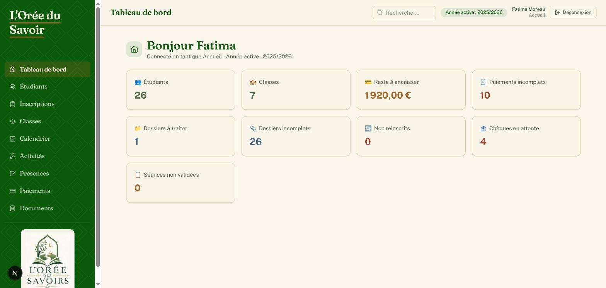
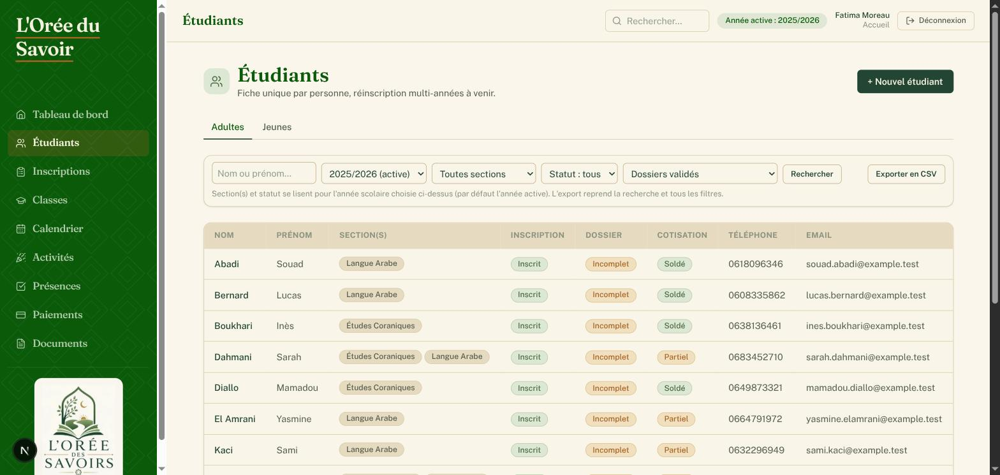
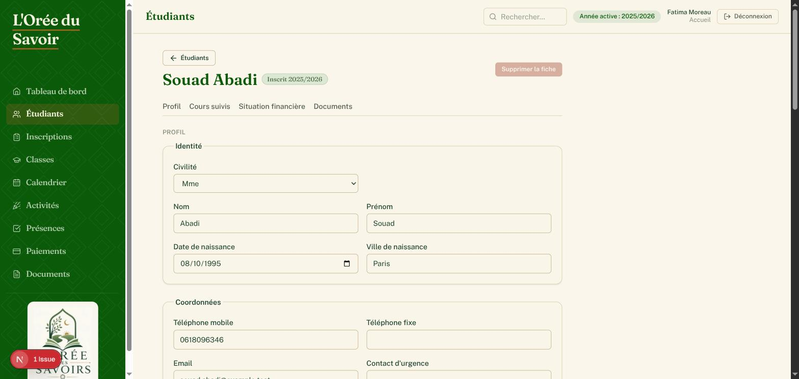
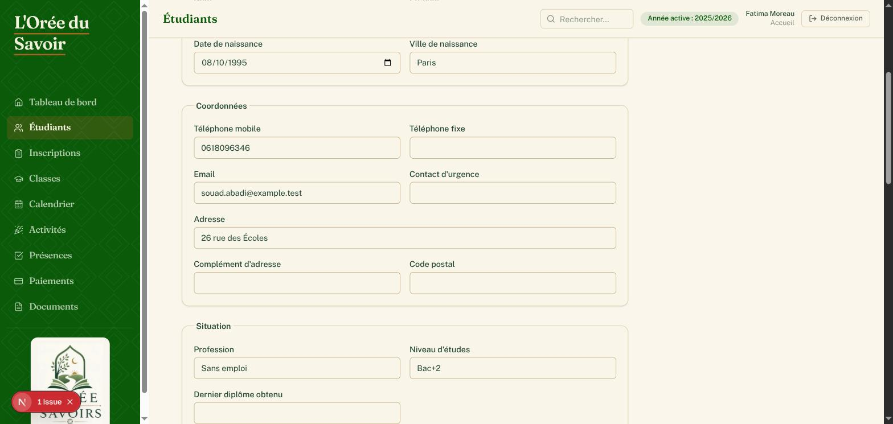
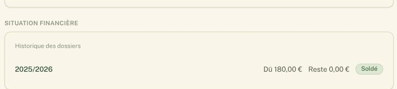
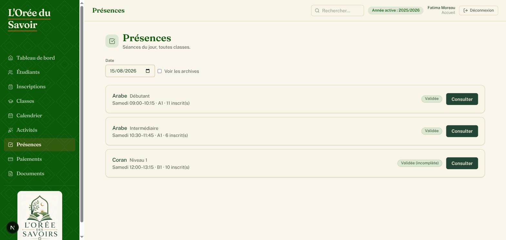
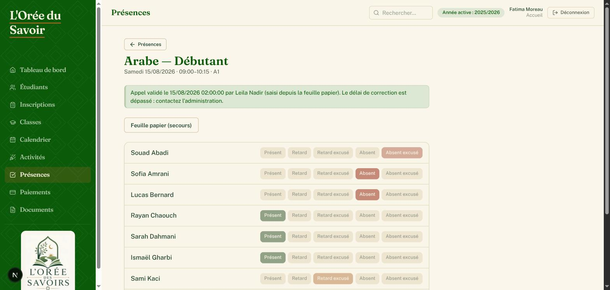

# Guide utilisateur — Accueil

Ce guide explique, étape par étape, comment consulter les informations des étudiants et des présences dans l'application de gestion de L'Orée du Savoir avec le rôle **Accueil**.

Vous n'avez pas besoin de connaissances techniques pour suivre ce guide : chaque étape correspond à un bouton ou un champ que vous verrez réellement à l'écran.

## Sommaire

1. [Se connecter](#1-se-connecter)
2. [Rechercher et consulter un étudiant](#2-rechercher-et-consulter-un-étudiant)
3. [Consulter les présences](#3-consulter-les-présences)
4. [À retenir](#4-à-retenir)

---

## 1. Se connecter

1. Ouvrez l'application dans votre navigateur.
2. Renseignez votre **Email** et votre **Mot de passe**, puis cliquez sur **Se connecter**.

   

3. Vous arrivez sur le **Tableau de bord**, avec le menu de navigation sur la gauche (Étudiants, Présences, Calendrier, Activités…).

   

---

## 2. Rechercher et consulter un étudiant

### 2.1 Utiliser la recherche et les filtres

1. Dans le menu, cliquez sur **Étudiants**.
2. Tapez un nom ou un prénom dans la barre de recherche **Nom ou prénom…**.
3. Vous pouvez affiner avec les filtres **Année scolaire**, **Section** et **Statut d'inscription** (Inscrits / Non inscrits).
4. Cliquez sur **Rechercher**.

   

5. Le tableau affiche, pour chaque étudiant trouvé : Nom, Prénom, Section(s), statut d'**Inscription**, statut du **Dossier** (Complet/Incomplet) et statut de **Cotisation**, ainsi que Téléphone et Email.

### 2.2 Lire la fiche d'un étudiant

1. Cliquez sur le nom d'un étudiant dans le tableau pour ouvrir sa fiche.
2. En haut de la fiche, un menu rapide permet d'aller directement à une section : **Profil**, **Cours suivis**, **Situation financière**.

   

3. La section **Profil** affiche l'identité (date de naissance, ville de naissance), les coordonnées (téléphone, email, adresse, contact d'urgence) et les responsables légaux (nom, lien de parenté, téléphone, email).

   

4. La section **Cours suivis** liste les classes dans lesquelles l'étudiant est inscrit, avec le jour et l'horaire de chaque classe.

5. La section **Situation financière** indique, pour chaque année scolaire, le montant **Dû**, le **Reste** à payer et le **Statut** du dossier.

   

> Cette page permet de répondre rapidement à une famille qui demande où en est l'inscription ou le paiement de son enfant, sans avoir à chercher ailleurs.

---

## 3. Consulter les présences

### 3.1 Voir les séances du jour

1. Dans le menu, cliquez sur **Présences**. Vous voyez toutes les séances du jour, toutes classes confondues.
2. Changez la **Date** en haut de la page pour consulter un autre jour.

   

3. Chaque séance affiche son statut : **À faire**, **Validée** (avec le nombre de présences enregistrées) ou **Annulée** (avec le motif s'il est renseigné).

### 3.2 Consulter une feuille de présence déjà validée

1. Sur une séance dont le statut est **Validée**, cliquez sur **Consulter**.
2. Vous voyez le statut de chaque étudiant (Présent, Retard, Retard excusé, Absent, Absent excusé), ainsi que la date et l'heure de validation et le nom de la personne qui a validé.

   

> C'est la manière la plus rapide de répondre à une question du type « Est-ce que mon enfant était bien présent mardi dernier ? ».

---

## 4. À retenir

- **On ne devine jamais une absence** : une feuille de présence n'apparaît comme « Validée » que si l'enseignant (ou l'administration) a renseigné un statut pour chaque étudiant.
- **Le QR code affiché en salle n'authentifie jamais personne** — il n'est utile qu'aux enseignants, connectés avec leur propre compte, pour accéder à la feuille de présence du jour.
- Pour toute inscription, modification de dossier ou paiement, orientez la famille vers l'Administration ou le Bureau.
