# Guide utilisateur — Administration

Ce guide explique, étape par étape, comment utiliser l'application de gestion de L'Orée du Savoir avec le rôle **Administration** : inscrire un étudiant, gérer les classes, prendre les présences, et consulter les paiements.

Vous n'avez pas besoin de connaissances techniques pour suivre ce guide : chaque étape correspond à un bouton ou un champ que vous verrez réellement à l'écran.

## Sommaire

1. [Se connecter](#1-se-connecter)
2. [Inscrire un étudiant](#2-inscrire-un-étudiant)
3. [Gérer les classes](#3-gérer-les-classes)
4. [Prendre les présences](#4-prendre-les-présences)
5. [Consulter les paiements](#5-consulter-les-paiements)
6. [À retenir](#6-à-retenir)

---

## 1. Se connecter

1. Ouvrez l'application dans votre navigateur.
2. Renseignez votre **Email** et votre **Mot de passe**, puis cliquez sur **Se connecter**.

   

3. Vous arrivez sur le **Tableau de bord**, avec le menu de navigation sur la gauche.

   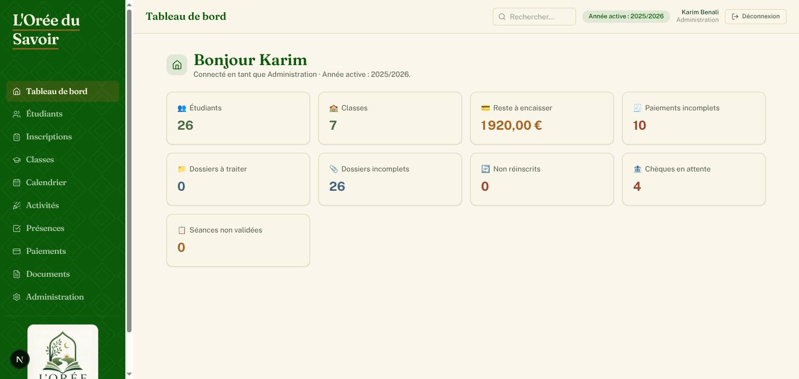

---

## 2. Inscrire un étudiant

### 2.1 Contrôler une préinscription reçue en ligne

Les familles peuvent préremplir leur dossier elles-mêmes en ligne, sans compte. Ces dossiers arrivent avec le statut **« Préinscrit — à valider »** et doivent être contrôlés sur place (signature, documents, paiement) avant validation définitive.

1. Dans le menu, cliquez sur **Inscriptions** : vous voyez la liste des préinscriptions en attente.

   

2. Cliquez sur le nom d'un étudiant pour ouvrir sa fiche et poursuivre le contrôle (étapes 2.3 à 2.5 ci-dessous).

> Si un doublon potentiel a été détecté (même nom/prénom/date de naissance, ou mêmes coordonnées de responsable qu'une fiche existante), un bandeau orange s'affiche sur la fiche avec les options **Mettre à jour la fiche existante** ou **Ce n'est pas un doublon (homonymie)**.

### 2.2 Créer une fiche étudiant sur place

Si une famille se présente directement sans avoir préempli le formulaire en ligne :

1. Dans le menu, cliquez sur **Étudiants**, puis sur **+ Nouvel étudiant**.
2. Remplissez la section **Identité** : Civilité, Nom, Prénom (obligatoires), Date de naissance, Ville de naissance.
3. Remplissez la section **Coordonnées** : téléphones, email, contact d'urgence, adresse.
4. Remplissez la section **Situation** si utile : profession, niveau d'études, dernier diplôme, remarque.
5. Renseignez un ou deux **Responsables légaux** (père, mère, tuteur…) si l'étudiant est mineur.

   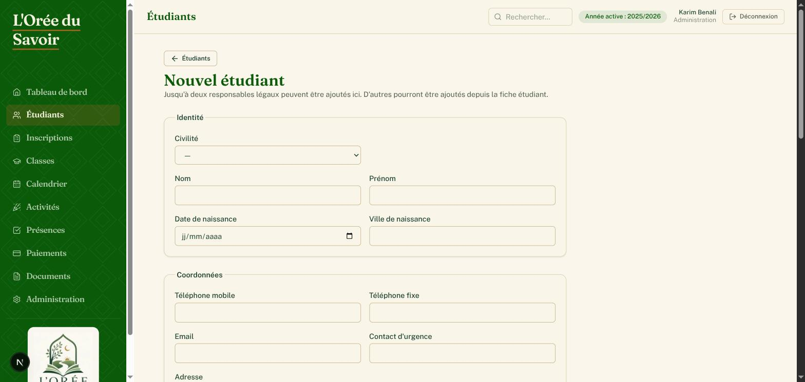

6. Cliquez sur **Créer la fiche**.

> **Doublon détecté** : si un étudiant du même nom/prénom existe déjà, vérifiez qu'il ne s'agit pas de la même personne avant de cliquer sur **Créer quand même une nouvelle fiche**.

### 2.3 Compléter le dossier documentaire

Sur la fiche de l'étudiant, section **Documents** :

1. Pour ajouter une pièce fournie par la famille (pièce d'identité, photo, dossier signé…) : choisissez le **Type**, sélectionnez le **Fichier**, cliquez sur **Téléverser**.
2. Pour générer le dossier d'inscription officiel pré-rempli (gabarit Word de l'association) : choisissez la **Section**, cliquez sur **Générer (Word)**. Imprimez-le, faites-le signer par la famille, puis téléversez-le en tant que « Dossier signé ».

   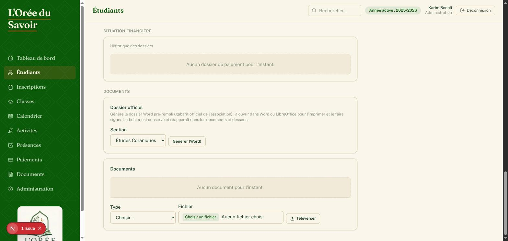

### 2.4 Inscrire l'étudiant à une classe

Sur la fiche de l'étudiant, section **Cours suivis** :

1. Filtrez éventuellement par **Section**.
2. Choisissez une **Classe** dans la liste déroulante, puis cliquez sur **Inscrire**.

   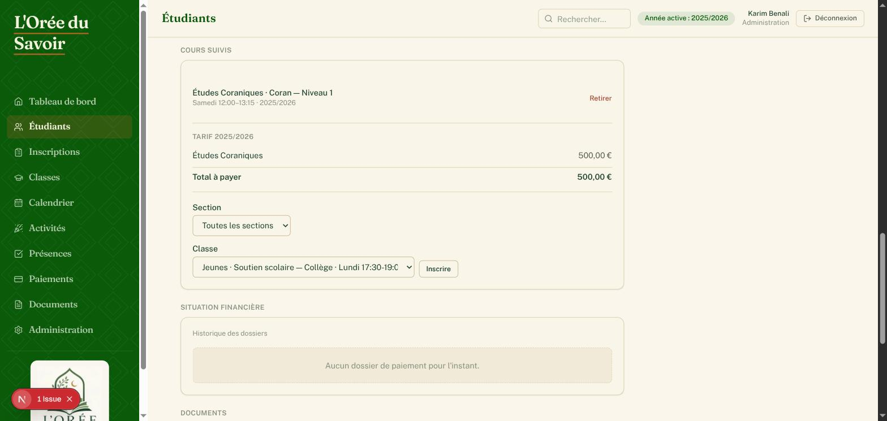

### 2.5 Valider l'inscription

Une fois les documents vérifiés et l'étudiant inscrit dans une classe :

1. En haut de la fiche étudiant, cliquez sur **Valider l'inscription**.

   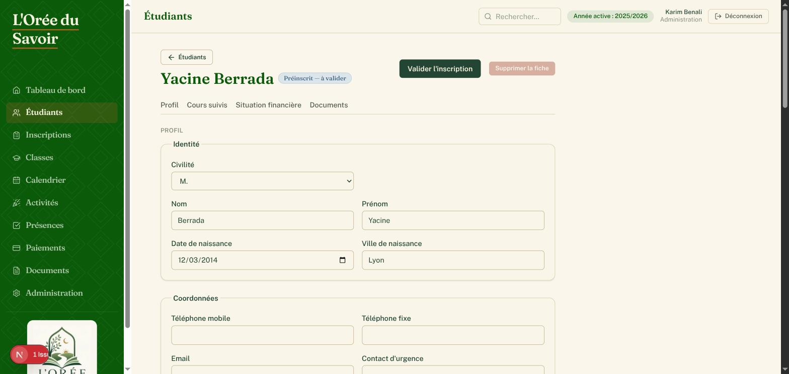

2. Le statut passe de « Préinscrit » à un badge **Inscrit** ou **Réinscrit** pour l'année active.

> Pour le suivi financier du dossier (création du dossier de paiement, montant dû), voir §5 — la création de dossier reste réservée au Bureau et au Trésorier.

---

## 3. Gérer les classes

### 3.1 Consulter la liste des classes

1. Dans le menu, cliquez sur **Classes**.
2. Recherchez par cours, niveau, salle ou enseignant, ou filtrez par **Année scolaire**, **Section** ou **Jour**.

   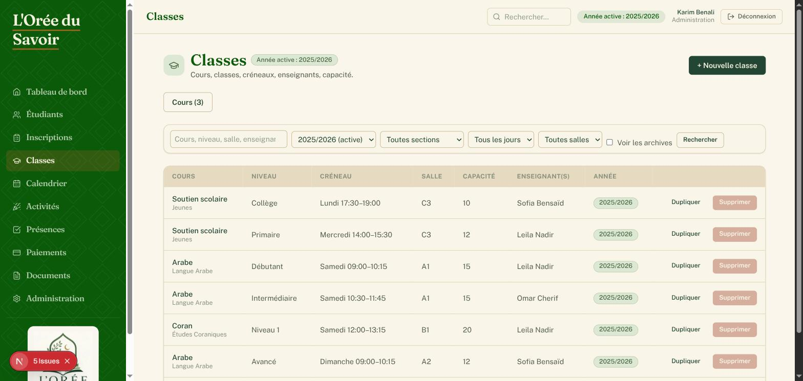

### 3.2 Créer une classe

Un « cours » (ex. Arabe débutant) doit exister avant de créer une « classe » (le groupe concret avec son créneau). Le bouton **Cours (N)** en haut de la page **Classes** permet d'en créer un nouveau si besoin (Nom + Section).

1. Sur la page **Classes**, cliquez sur **+ Nouvelle classe**.
2. Renseignez **Cours**, **Année scolaire**, **Niveau** (optionnel), **Semestre** (optionnel).
3. Renseignez le **Créneau** : Jour, Heure de début, Heure de fin.
4. Renseignez **Salle** et **Capacité** si besoin.
5. Cochez le ou les **Enseignant(s)** assignés.

   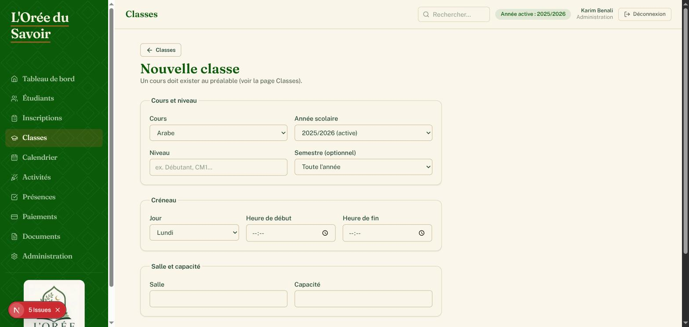

6. Cliquez sur **Créer la classe**.

### 3.3 Générer les séances

Les dates de séances sont calculées automatiquement à partir du créneau hebdomadaire, en sautant les vacances.

1. Ouvrez la fiche de la classe.
2. Dans la carte **Séances**, cliquez sur **Générer les séances manquantes**.

   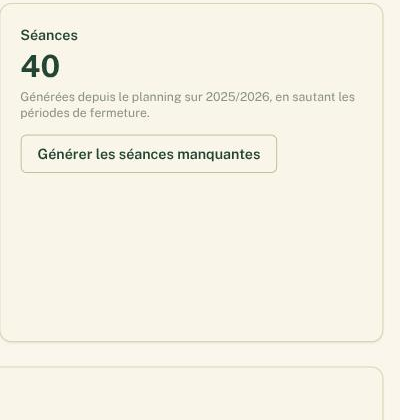

> Le QR code affiché sur la fiche de la classe sert à l'enseignant pour accéder directement à la feuille de présence du jour depuis son téléphone — il ne remplace jamais sa connexion.

### 3.4 Gérer les inscriptions d'une classe

Sur la fiche d'une classe, carte **Étudiants inscrits** : choisissez un étudiant et cliquez sur **Inscrire**, ou cliquez sur **Retirer** pour désinscrire.

---

## 4. Prendre les présences

### 4.1 Consulter les séances du jour

1. Dans le menu, cliquez sur **Présences**. Vous voyez toutes les séances du jour, toutes classes confondues.
2. Changez la **Date** en haut si besoin.

   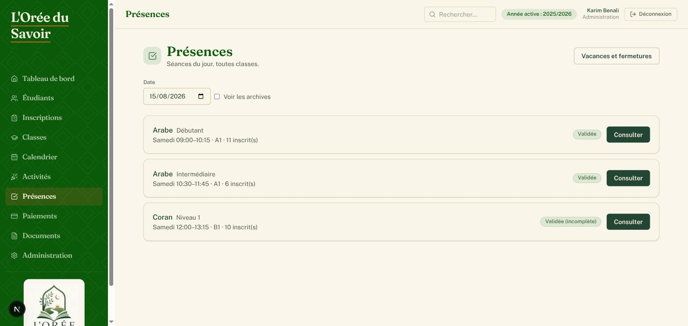

### 4.2 Faire l'appel

1. Cliquez sur **Faire l'appel** pour une séance.
2. Par défaut, tout le monde est marqué **Présent**. Changez le statut individuel si besoin : **Présent**, **Retard**, **Retard excusé**, **Absent**, **Absent excusé**.

   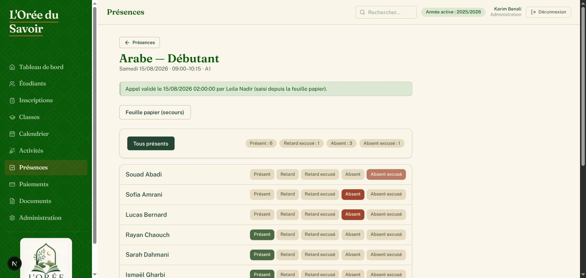

3. Si vous saisissez depuis une feuille papier remplie en salle, cochez **Saisie depuis la feuille papier**.
4. Cliquez sur **Valider l'appel**.

> **Règle importante : on ne devine jamais une absence.** Un statut doit être renseigné pour chaque étudiant avant de valider.

### 4.3 Annuler une séance ou corriger après le délai

En tant qu'Administration, vous pouvez :

- **Annuler une séance** : en bas de la page de la séance, renseignez un motif (ex. « enseignant absent ») et cliquez sur **Annuler la séance**.
- **Corriger une feuille déjà validée, sans limite de délai** (contrairement aux enseignants, limités au jour même) : rouvrez la séance et modifiez les statuts, puis cliquez sur **Enregistrer la correction**.
- **Gérer les vacances et fermetures** : depuis la page **Présences**, cliquez sur **Vacances et fermetures**, renseignez Année scolaire, Libellé, Du, Au, puis **Ajouter**.

  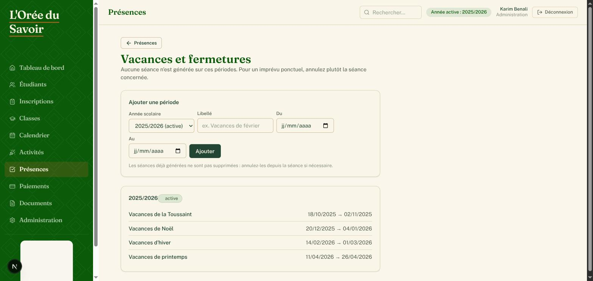

---

## 5. Consulter les paiements

### 5.1 Consulter la liste des dossiers

1. Dans le menu, cliquez sur **Paiements**.
2. Filtrez par étudiant, **Année scolaire** ou **Section**.

   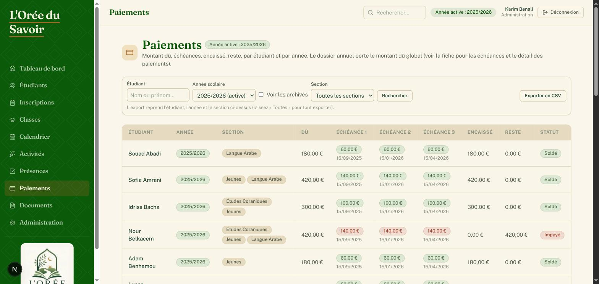

3. Le tableau affiche, pour chaque dossier : le montant **Dû**, chaque **Échéance**, le total **Encaissé**, le **Reste** à payer et le **Statut**.
4. Le lien **Exporter en CSV** télécharge la liste avec les filtres appliqués.

### 5.2 Consulter le détail d'un dossier

Cliquez sur le nom d'un étudiant pour ouvrir son dossier : vous y voyez le détail de chaque échéance, les paiements enregistrés (montant, moyen, date) et les éventuels **Incidents** (chèque impayé, prélèvement rejeté).

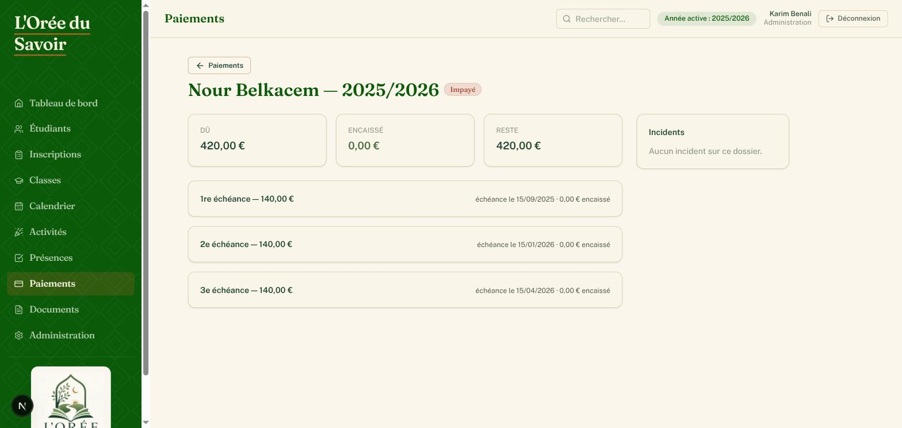

> La saisie d'un nouveau paiement ou la création d'un dossier reste réservée au Bureau et au Trésorier.

### 5.3 Générer un reçu ou une attestation

Depuis la fiche étudiant, section **Situation financière**, chaque dossier annuel propose les liens **Reçu (PDF)** et **Attestation (PDF)** : vous pouvez les générer même sans saisir de paiement.

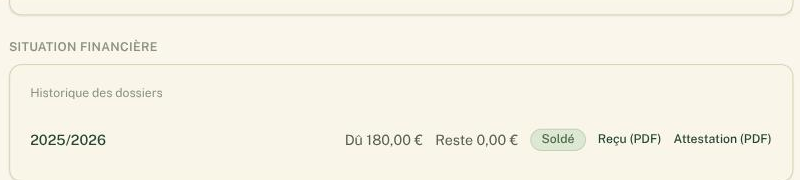

---

## 6. À retenir

- **Le QR code n'authentifie jamais personne** — c'est un raccourci vers la séance du jour, l'enseignant doit toujours être connecté avec son propre compte.
- **On ne devine jamais une absence** : une feuille de présence incomplète ne peut pas être validée.
- **Vous n'êtes pas soumis au délai de correction du jour même** — contrairement aux enseignants, vous pouvez corriger une feuille de présence à tout moment.
- **Les fichiers (photos, pièces d'identité, dossiers signés) sont toujours séparés de la base de données** : ils sont téléversés depuis la fiche étudiant.
- Pour la saisie des paiements et la trésorerie, adressez-vous au Bureau ou au Trésorier.
