# Guide utilisateur — Bureau / Président

Ce guide explique, étape par étape, comment utiliser l'application de gestion de L'Orée du Savoir. Le rôle **Bureau** a accès à toutes les fonctions : étudiants, classes, présences, activités, paiements et trésorerie.

Vous n'avez pas besoin de connaissances techniques pour suivre ce guide : chaque étape correspond à un bouton ou un champ que vous verrez réellement à l'écran.

## Sommaire

1. [Se connecter](#1-se-connecter)
2. [Le tableau de bord](#2-le-tableau-de-bord)
3. [Gérer les étudiants](#3-gérer-les-étudiants)
4. [Gérer les classes](#4-gérer-les-classes)
5. [Suivre les présences](#5-suivre-les-présences)
6. [Gérer les activités](#6-gérer-les-activités)
7. [Suivre les paiements](#7-suivre-les-paiements)
8. [Gérer la trésorerie](#8-gérer-la-trésorerie)
9. [À retenir](#9-à-retenir)

---

## 1. Se connecter

1. Ouvrez l'application dans votre navigateur.
2. Renseignez votre **Email** et votre **Mot de passe**, puis cliquez sur **Se connecter**.

   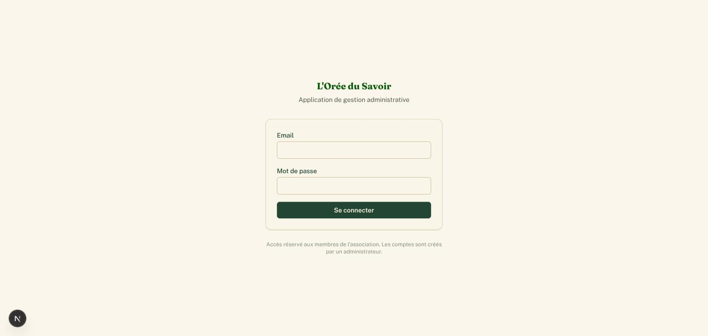

3. Vous arrivez sur le **Tableau de bord**, avec le menu de navigation sur la gauche (Étudiants, Inscriptions, Classes, Calendrier, Activités, Présences, Paiements, Trésorerie, Documents, Administration).

   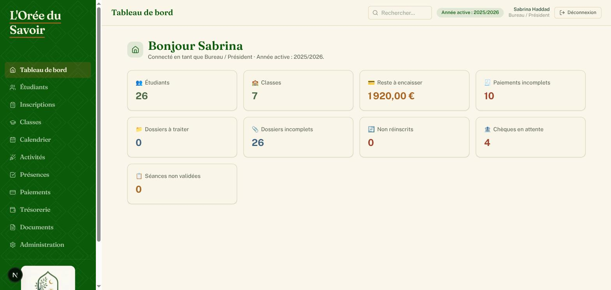

---

## 2. Le tableau de bord

La page d'accueil (**Tableau de bord**) donne une vue d'ensemble : nombre d'étudiants inscrits, nombre de classes, préinscriptions en attente, étudiants non réinscrits, chèques en attente d'encaissement, séances non validées, et rappels d'activités à venir.

C'est un bon point de départ chaque matin pour repérer ce qui demande votre attention.

---

## 3. Gérer les étudiants

### 3.1 Rechercher un étudiant

1. Dans le menu, cliquez sur **Étudiants**.
2. Utilisez la barre de recherche **Nom ou prénom…**, ou les filtres **Année scolaire**, **Section**, **Statut d'inscription** (Inscrits / Non inscrits) et **Dossier** (Dossiers validés / Préinscriptions seulement / Tous).
3. Cliquez sur **Rechercher**.

   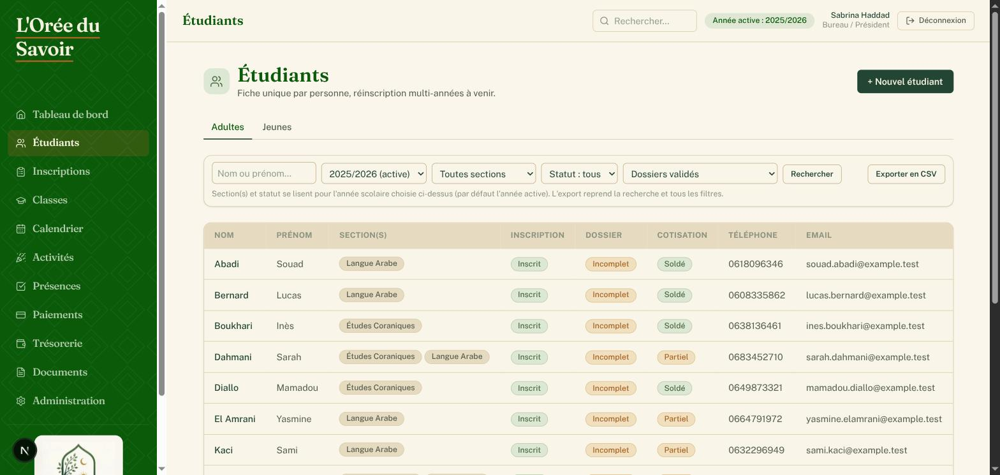

4. Le bouton **Exporter en CSV** (en haut à droite du tableau) télécharge la liste affichée, avec les filtres appliqués.

### 3.2 Créer une nouvelle fiche étudiant

1. Sur la page **Étudiants**, cliquez sur **+ Nouvel étudiant**.
2. Remplissez la section **Identité** : Civilité, Nom, Prénom (obligatoires), Date de naissance, Ville de naissance.
3. Remplissez la section **Coordonnées** : téléphones, email, contact d'urgence, adresse.
4. Remplissez la section **Situation** si utile : profession, niveau d'études, dernier diplôme, remarque.
5. Renseignez un ou deux **Responsables légaux** (père, mère, tuteur…) si l'étudiant est mineur.

   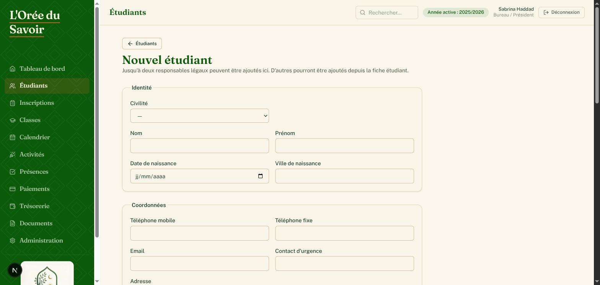

6. Cliquez sur **Créer la fiche**.

> **Doublon détecté** : si un étudiant du même nom/prénom existe déjà, un message **« Étudiant(s) similaire(s) déjà enregistré(s) »** apparaît. Vérifiez qu'il ne s'agit pas de la même personne avant de cliquer sur **Créer quand même une nouvelle fiche**.

### 3.3 Valider une préinscription

Les familles peuvent préremplir leur dossier elles-mêmes en ligne, sans compte, depuis le formulaire public. Ces préinscriptions arrivent avec le statut **« Préinscrit — à valider »**.

1. Dans le menu, cliquez sur **Inscriptions** : vous voyez la liste des préinscriptions en attente de contrôle sur place (signature, documents, paiement).

   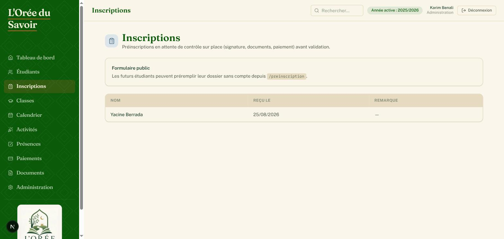

2. Cliquez sur le nom d'un étudiant pour ouvrir sa fiche.
3. Vérifiez/complétez ses informations, ajoutez les documents fournis (voir §3.4).
4. Cliquez sur **Valider l'inscription** en haut de la fiche.

> Si un doublon potentiel a été détecté automatiquement (même nom/prénom/date de naissance, ou mêmes coordonnées de responsable qu'une fiche existante), un bandeau orange propose **Mettre à jour la fiche existante** ou **Ce n'est pas un doublon (homonymie)**.

### 3.4 Compléter le dossier documentaire

Sur la fiche d'un étudiant, section **Documents** :

1. Pour ajouter une pièce fournie par la famille (pièce d'identité, photo, dossier signé, justificatif de paiement, attestation de scolarité…) : choisissez le **Type**, sélectionnez le **Fichier**, cliquez sur **Téléverser**.
2. Pour générer le dossier d'inscription officiel pré-rempli (gabarit Word de l'association) : choisissez la **Section**, cliquez sur **Générer (Word)**. Le fichier s'ouvre dans un nouvel onglet — imprimez-le, faites-le signer, puis téléversez-le en tant que « Dossier signé ».

   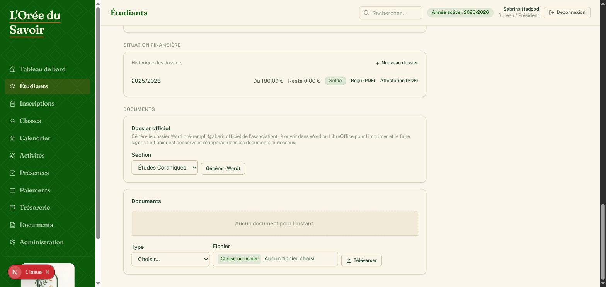

3. Chaque document peut être **Voir**, **Télécharger** ou **Supprimer** individuellement.

### 3.5 Inscrire un étudiant à une classe

Sur la fiche d'un étudiant, section **Cours suivis** :

1. Filtrez éventuellement par **Section**.
2. Choisissez une **Classe** dans la liste déroulante, puis cliquez sur **Inscrire**.

   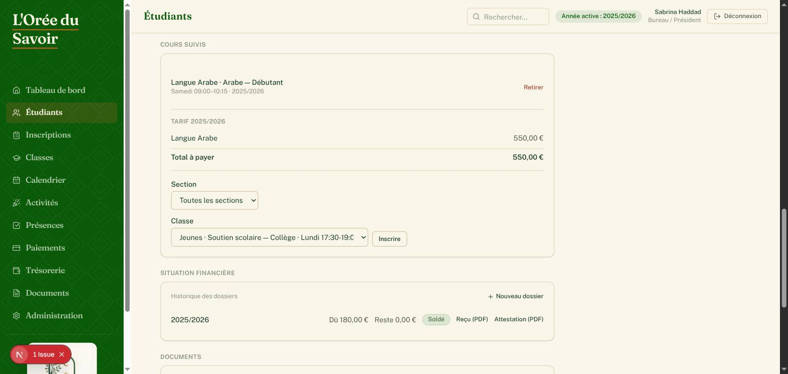

3. Pour retirer un étudiant d'une classe, cliquez sur **Retirer** à côté de l'inscription concernée.

### 3.6 Suivre la situation financière d'un étudiant

Toujours sur la fiche étudiant, section **Situation financière** :

- Si aucun dossier n'existe pour l'année active, cliquez sur **Créer le dossier [année]**.
- La liste des dossiers annuels affiche le montant **Dû**, le **Reste** à payer et le **Statut**.
- Cliquez sur une année pour ouvrir le dossier et enregistrer un paiement (voir §7).
- Les liens **Reçu (PDF)** et **Attestation (PDF)** génèrent les justificatifs officiels.

---

## 4. Gérer les classes

### 4.1 Créer un cours

Un « cours » (ex. Arabe débutant) doit exister avant de pouvoir créer une « classe » (le groupe concret avec son créneau).

1. Sur la page **Classes**, cliquez sur le bouton **Cours (N)**.
2. Dans la fenêtre qui s'ouvre, renseignez le **Nom du nouveau cours** et sa **Section**, puis cliquez sur **Ajouter**.

   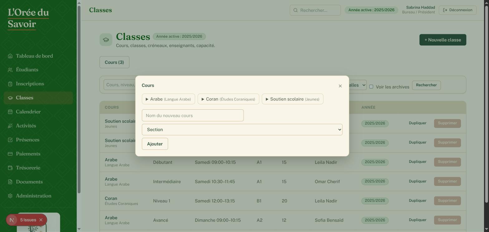

### 4.2 Créer une classe

1. Sur la page **Classes**, cliquez sur **+ Nouvelle classe**.
2. Renseignez **Cours**, **Année scolaire**, **Niveau** (optionnel) et **Semestre** (optionnel, sinon toute l'année).
3. Renseignez le **Créneau** : Jour, Heure de début, Heure de fin.
4. Choisissez la **Salle** si besoin (liste des salles déjà créées depuis *Administration → Salles* — voir §4.4).
5. Cochez le ou les **Enseignant(s)** assignés à cette classe.

   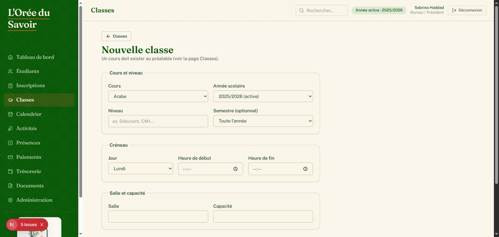

6. Cliquez sur **Créer la classe**.

> **Dupliquer une classe** : depuis la liste des classes ou la fiche d'une classe, le lien **Dupliquer** reprend le cours, le créneau et la salle pour créer rapidement une classe similaire (sans reprendre les étudiants ni l'enseignant).

### 4.3 Générer les séances

Les séances (dates concrètes) sont calculées automatiquement à partir du créneau hebdomadaire de la classe, sur toute l'année scolaire, en sautant les périodes de vacances/fermeture.

1. Ouvrez la fiche d'une classe (cliquez sur son nom depuis la liste **Classes**).
2. Dans la carte **Séances**, cliquez sur **Générer les séances manquantes**.

   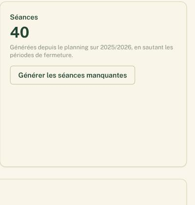

> Cette action est **sans risque** à relancer : elle ne crée jamais deux fois la même séance.

### 4.4 Afficher le QR code d'une salle

Le QR code n'est plus attaché à une classe mais à une **salle** : un seul code, permanent, sert pour tous les cours qui s'y succèdent au fil de la journée — il n'est jamais à régénérer ni à réimprimer entre deux cours.

1. Depuis **Administration → Salles**, créez la salle si elle n'existe pas encore (un simple nom, ex. « Salle 1 »).
2. Sur cette même page, chaque salle affiche son QR code et son adresse.
3. Imprimez-le ou affichez-le sur un écran, une bonne fois pour toutes, dans la salle correspondante.

   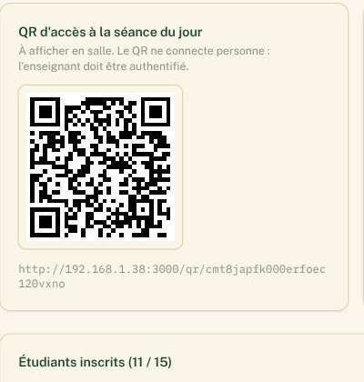

4. Affectez ensuite cette salle à chaque classe qui s'y déroule (formulaire de la classe, champ **Salle** — voir §4.2/§4.4). Un rappel du même QR est aussi visible sur la fiche de chaque classe qui y est rattachée.

> **Important** : le QR code n'est **jamais** une authentification. Il identifie la salle ; l'enseignant doit être connecté avec son propre compte, puis choisit son cours parmi ceux du jour dans cette salle qui le concernent, avant de faire l'appel.

### 4.5 Gérer les inscriptions d'une classe

Sur la fiche d'une classe, carte **Étudiants inscrits** :

1. Filtrez par nom/prénom si besoin, puis choisissez un étudiant dans la liste et cliquez sur **Inscrire**.
2. Cliquez sur **Retirer** pour désinscrire un étudiant.

---

## 5. Suivre les présences

### 5.1 Consulter les séances du jour

1. Dans le menu, cliquez sur **Présences**. Vous voyez toutes les séances du jour, toutes classes confondues.
2. Changez la **Date** en haut si besoin, ou cochez **Voir les archives** pour les années archivées.

   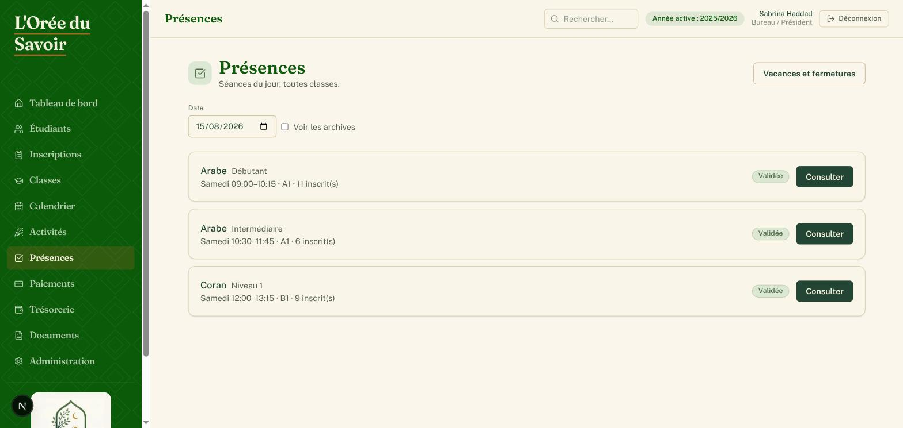

3. Chaque séance affiche son statut (**À faire**, **Validée**, **Annulée**) et un bouton **Faire l'appel** (ou **Consulter** si déjà validée).

### 5.2 Faire l'appel

1. Cliquez sur **Faire l'appel** pour une séance.
2. Par défaut, tout le monde est marqué **Présent**. Cliquez sur **Tous présents** pour réinitialiser, ou changez le statut individuel de chaque étudiant : **Présent**, **Retard**, **Retard excusé**, **Absent**, **Absent excusé**.

   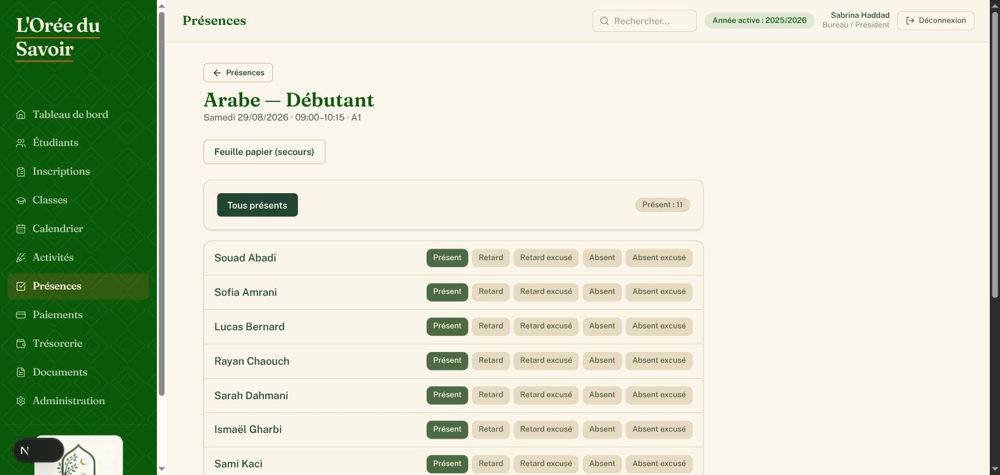

3. Si vous saisissez depuis une feuille papier remplie en salle, cochez **Saisie depuis la feuille papier**.
4. Cliquez sur **Valider l'appel**.

> **Règle importante : on ne devine jamais une absence.** Un statut doit être renseigné pour chaque étudiant avant de valider — sinon rien n'est enregistré.

### 5.3 Corriger une feuille déjà validée

1. Rouvrez la séance depuis **Présences**, bouton **Consulter**.
2. Modifiez les statuts nécessaires, puis cliquez sur **Enregistrer la correction**.

> La correction n'est possible que **le jour même** de la séance pour la plupart des rôles. Passé ce délai, un message invite à contacter l'administration (le Bureau et l'Administration ne sont pas soumis à cette limite).

### 5.4 Annuler une séance

En bas de la page d'une séance (réservé Bureau/Administration) :

1. Renseignez éventuellement un **motif** (ex. « enseignant absent », « jour férié »).
2. Cliquez sur **Annuler la séance**.

   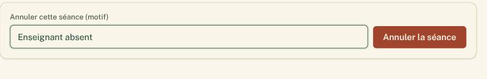

### 5.5 Gérer les vacances et fermetures

1. Sur la page **Présences**, cliquez sur **Vacances et fermetures**.
2. Renseignez **Année scolaire**, **Libellé** (ex. « Vacances de février »), **Du** et **Au**, puis cliquez sur **Ajouter**.

   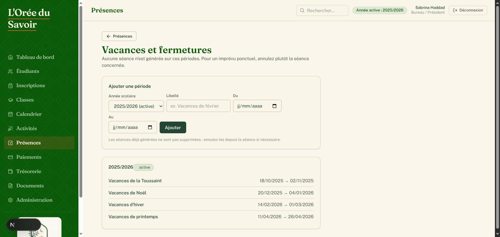

> Aucune séance n'est générée sur ces périodes. Pour un imprévu ponctuel sur une seule séance, utilisez plutôt l'annulation (§5.4). Modifier une période après coup ne supprime pas rétroactivement les séances déjà générées.

---

## 6. Gérer les activités

### 6.1 Créer une activité

1. Dans le menu, cliquez sur **Activités**, puis sur **+ Nouvelle activité**.
2. Renseignez **Titre**, **Lieu** (optionnel), **Date de début**, **Date de fin** (si plusieurs jours), **Heure de début/fin** (optionnel).
3. Choisissez une **Récurrence** si l'activité se répète (hebdomadaire, mensuelle…) et sa date de fin de récurrence.
4. Ajoutez un **Contenu** (détails visibles sur le calendrier).
5. Cochez le ou les **Responsable(s) / gestionnaire(s)** parmi les comptes « Responsable activités ».

   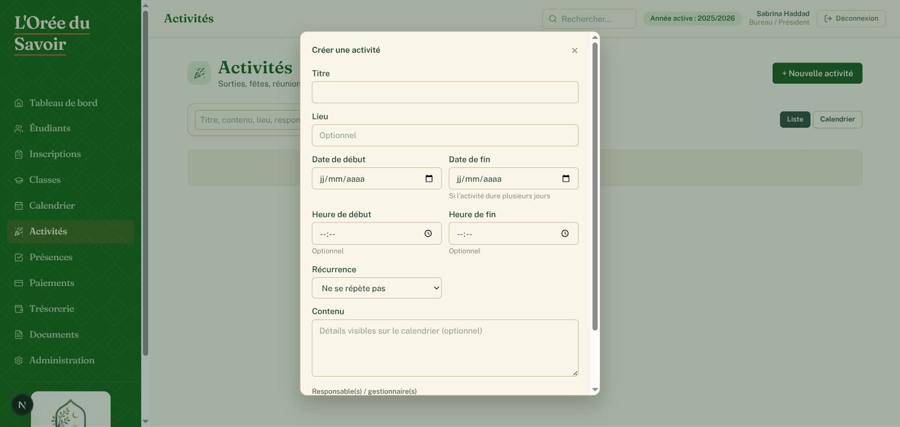

6. Cliquez sur **Créer l'activité**.

### 6.2 Vue liste et vue calendrier

- Le bouton **Liste** regroupe les activités par semestre, avec un badge **En cours** pour le semestre actuel.
- Le bouton **Calendrier** affiche un calendrier mensuel avec les activités du jour.

  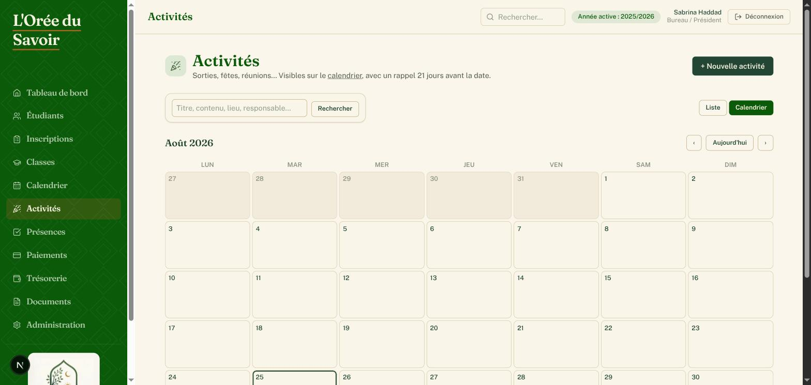

- Un rappel s'affiche automatiquement quelques jours avant la date de chaque activité.

---

## 7. Suivre les paiements

### 7.1 Créer un dossier de paiement

1. Dans le menu, cliquez sur **Paiements**, puis sur **+ Nouveau dossier**.
2. Choisissez l'**Étudiant** et l'**Année scolaire**.
3. Le **Montant dû** est suggéré automatiquement à partir des tarifs des sections suivies, mais reste modifiable.

   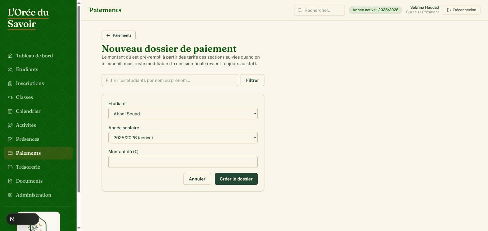

4. Cliquez sur **Créer le dossier**.

### 7.2 Ajouter une échéance et enregistrer un paiement

Sur la fiche d'un dossier de paiement :

1. Pour ajouter une échéance : renseignez **Libellé**, **Montant**, **Date d'échéance**, cliquez sur **Ajouter**.
2. Pour enregistrer un paiement sur une échéance : renseignez le **Montant**, choisissez le **Moyen** (Espèces, Chèque, Virement, Carte bancaire, Prélèvement).
   - Si **Chèque** : renseignez Banque, N° chèque, Titulaire.
   - Si **Prélèvement** : renseignez IBAN, BIC, Titulaire, Référence du mandat.
3. Cliquez sur **Enregistrer le paiement**.

   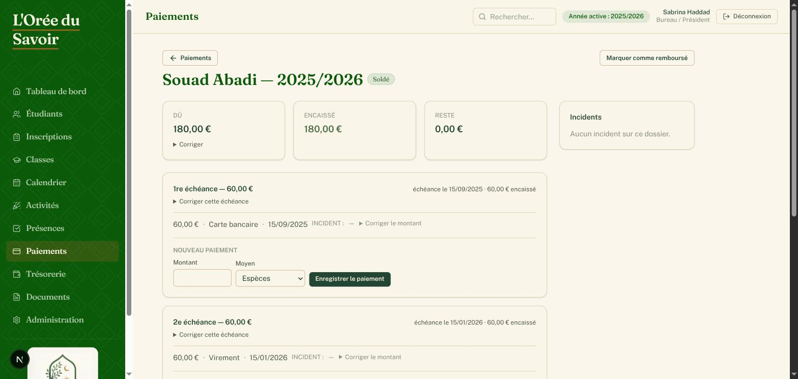

### 7.3 Suivre le statut d'un chèque

Chaque paiement par chèque affiche un statut modifiable : **Reçu → Déposé → Encaissé** (ou **Rejeté** en cas d'impayé, avec un motif). Ce statut se change directement depuis la fiche du dossier.

> Un chèque **Rejeté** ou un prélèvement rejeté apparaît automatiquement dans le bloc **Incidents** en haut de la fiche du dossier.

### 7.4 Générer un reçu ou une attestation

Depuis la fiche étudiant, section **Situation financière**, chaque dossier annuel propose deux liens : **Reçu (PDF)** et **Attestation (PDF)**, générés directement depuis les données du dossier.

---

## 8. Gérer la trésorerie

La trésorerie est un livre de caisse simple (recettes/dépenses), volontairement sans comptabilité en partie double.

### 8.1 Consulter le livre de caisse

1. Dans le menu, cliquez sur **Trésorerie**. Vous voyez le **Solde actuel**, le **Crédit**, le **Débit** et le **Résultat**.
2. Filtrez par date, type, catégorie, moyen de paiement ou recherche libre.

   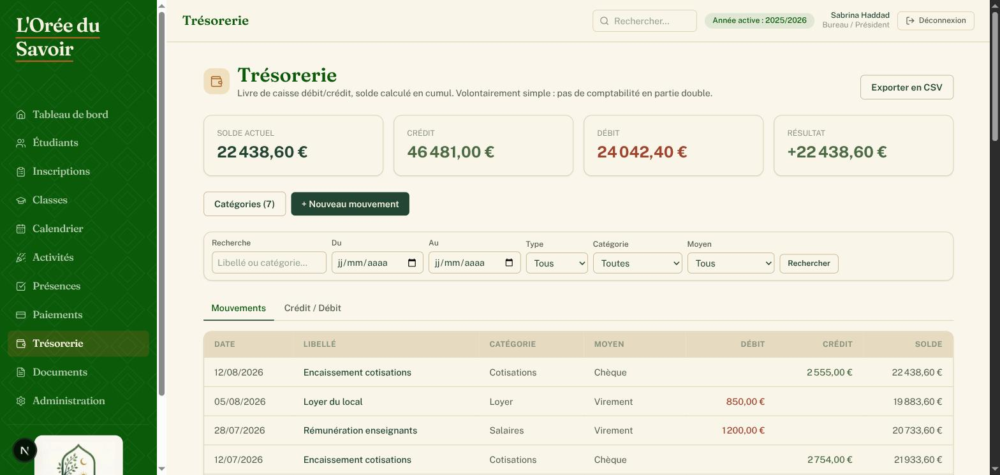

3. L'onglet **Crédit / Débit** sépare les deux colonnes côte à côte.

### 8.2 Ajouter un mouvement

1. Cliquez sur **+ Nouveau mouvement**.
2. Renseignez **Date**, **Libellé**, **Type** (Recette ou Dépense), **Moyen**, **Montant**, **Catégorie** et une référence de **Justificatif** si vous en avez une.

   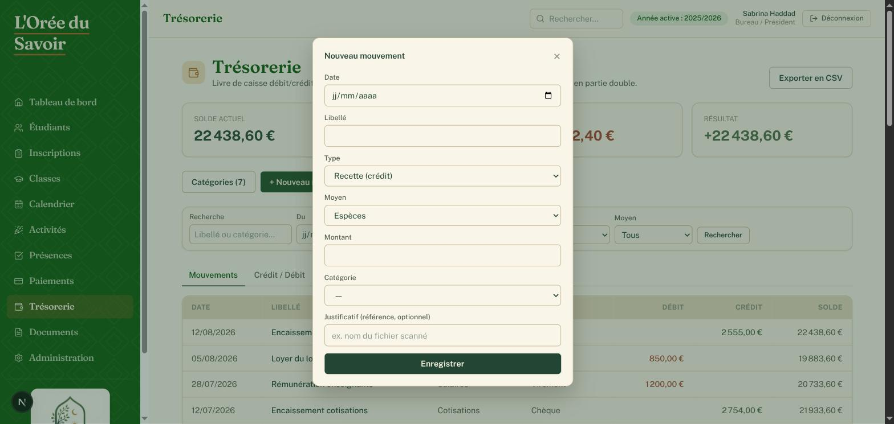

3. Cliquez sur **Enregistrer**.

### 8.3 Gérer les catégories

Cliquez sur le bouton **Catégories** pour créer, renommer ou désactiver une catégorie de mouvement (ex. « Cotisations », « Loyer », « Fournitures »).

### 8.4 Exporter

Le lien **Exporter en CSV** en haut de la page reprend les filtres actifs.

---

## 9. À retenir

- **Le QR code n'authentifie jamais personne** — il est permanent par salle et n'est qu'un raccourci vers les cours du jour de l'enseignant dans cette salle.
- **On ne devine jamais une absence** : une feuille de présence incomplète ne peut pas être validée.
- **La correction d'une présence n'est possible que le jour même** pour la plupart du personnel — le Bureau et l'Administration en sont dispensés.
- **Les fichiers (photos, pièces d'identité, dossiers signés) sont toujours séparés de la base de données** : ils sont téléversés depuis la fiche étudiant et ne doivent jamais être manipulés en dehors de l'application.
- **Un tarif de Section (frais de formation, de dossier, barème de remboursement) est une décision de l'association**, modifiable uniquement depuis *Administration → Sections* — jamais à la main dans un dossier individuel.
