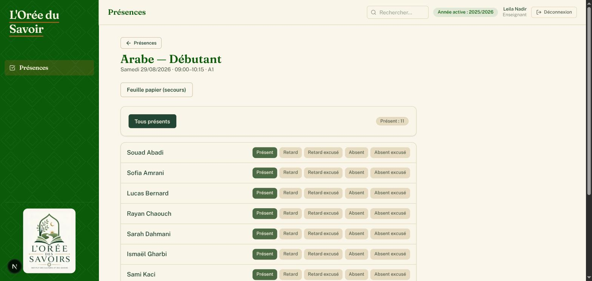
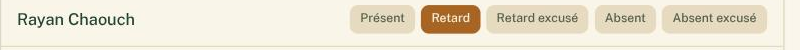
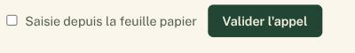
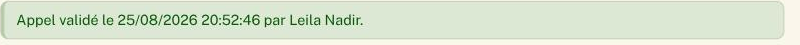
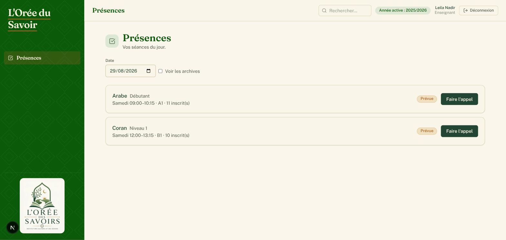

# Guide utilisateur — Enseignant

Ce guide explique, étape par étape, comment valider la présence de vos élèves via le QR code affiché en salle, dans l'application de gestion de L'Orée du Savoir.

Vous n'avez pas besoin de connaissances techniques pour suivre ce guide : chaque étape correspond à un écran que vous verrez réellement sur votre téléphone ou votre ordinateur.

## Sommaire

1. [Ce qu'il faut savoir avant de commencer](#1-ce-quil-faut-savoir-avant-de-commencer)
2. [Scanner le QR code affiché en salle](#2-scanner-le-qr-code-affiché-en-salle)
3. [Faire l'appel](#3-faire-lappel)
4. [Corriger une erreur après validation](#4-corriger-une-erreur-après-validation)
5. [Si vous n'avez pas de QR code sous la main](#5-si-vous-navez-pas-de-qr-code-sous-la-main)
6. [À retenir](#6-à-retenir)

---

## 1. Ce qu'il faut savoir avant de commencer

- Un **QR code** est affiché (imprimé ou sur un écran) dans chacune de vos salles de classe. Il correspond à **une seule classe**.
- **Le QR code ne vous connecte pas automatiquement.** Il vous amène directement à la feuille de présence du jour, mais vous devez d'abord être connecté avec votre propre compte (email + mot de passe fournis par l'administration).
- Vous n'avez accès qu'aux classes qui vous sont attribuées.

---

## 2. Scanner le QR code affiché en salle

1. Avec l'appareil photo de votre téléphone (ou une application de lecture de QR code), scannez le QR code affiché dans la salle.

   

2. Votre téléphone ouvre une page dans le navigateur.

   - **Si vous n'êtes pas encore connecté**, vous arrivez sur l'écran de connexion. Renseignez votre **Email** et votre **Mot de passe**, puis cliquez sur **Se connecter**.

     

   - **Si vous êtes déjà connecté**, vous arrivez directement sur la feuille de présence du jour (étape 3).

3. Après connexion, vous êtes automatiquement redirigé vers la feuille de présence de la séance du jour pour cette classe.

> Si le QR code ne correspond à aucune séance prévue aujourd'hui, ou si la séance a été annulée, un message clair vous l'indique à la place de la feuille de présence.

---

## 3. Faire l'appel

Une fois sur la page **« Appel du jour »** :

1. Vous voyez le nom de la classe, la date et l'horaire de la séance, ainsi que la liste de tous les élèves inscrits.

   

2. Par défaut, tous les élèves sont marqués **Présent**. Vous n'avez qu'à corriger les exceptions.
3. Pour changer le statut d'un élève, cliquez sur le bouton correspondant à côté de son nom :
   - **Présent**
   - **Retard**
   - **Retard excusé**
   - **Absent**
   - **Absent excusé**

   

4. Le bouton **Tous présents** en haut de l'écran permet de tout réinitialiser en un clic si besoin.
5. Si vous avez pris l'appel sur une feuille papier de secours et que vous ressaisissez maintenant, cochez la case **Saisie depuis la feuille papier**.
6. Une fois tous les statuts vérifiés, cliquez sur **Valider l'appel**.

   

> **Important : tant que vous n'avez pas cliqué sur « Valider l'appel », rien n'est enregistré.** Et si un élève n'a pas de statut renseigné, la validation est refusée avec le message « Merci de renseigner un statut pour chaque étudiant inscrit ».

7. Une fois validé, un message vert confirme **« Appel validé »**, avec la date, l'heure et votre nom.

   

---

## 4. Corriger une erreur après validation

Si vous vous êtes trompé sur un élève après avoir validé :

1. Revenez sur la page de la séance (en rescannant le QR code, ou en repassant par **Présences** dans le menu si vous êtes connecté normalement).
2. Modifiez le ou les statuts concernés.
3. Cliquez sur **Enregistrer la correction**.

> **La correction n'est possible que le jour même de la séance.** Passé ce délai, la feuille est verrouillée et un message vous invite à contacter l'administration pour toute modification.

---

## 5. Si vous n'avez pas de QR code sous la main

Vous pouvez aussi vous connecter normalement à l'application (adresse fournie par l'administration, email + mot de passe) : vous arrivez directement sur la page **Présences**, qui affiche vos séances du jour avec un bouton **Faire l'appel** pour chacune.

Le fonctionnement de l'appel est ensuite identique à celui décrit au §3.

---

## 6. À retenir

- **Le QR code n'est jamais une authentification** : il vous mène directement à la feuille de présence, mais vous devez être connecté avec votre propre compte.
- **On ne devine jamais une absence** : chaque élève doit avoir un statut renseigné avant de pouvoir valider l'appel.
- **La correction d'une feuille de présence n'est possible que le jour même** — au-delà, seule l'administration peut intervenir.
- La page d'appel atteinte par QR code est isolée : vous n'avez accès à aucune autre partie de l'application depuis cet écran. Pour vous déconnecter, utilisez le bouton **Déconnexion** en haut de la page.
